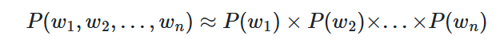
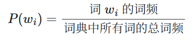

## 分词技术

### 歧义的来源

### 前缀词典（Trie 树）

前缀词典通常指的是**Trie树**，也叫**字典树**、**前缀树**，是一种专门用于处理字符串集合的高效树形数据结构。它的核心思想是利用字符串之间的公共前缀来减少查询时间，避免重复存储相同的前缀部分，从而在大量字符串的存储和检索中表现出色。

- **节点**：Trie树的每个节点代表一个字符（实际上是从根到该节点路径上所有字符组成的字符串），每个节点可以有多个子节点，每个子节点对应一个不同的字符。
- **根节点**：不包含任何字符，是空字符串的表示。
- **结束标记**：通常用一个布尔值 `isEnd` 标记当前节点是否是一个完整单词的结尾。

```
        root
       /    \
      c      d
     /        \
    a          o
   / \          \
  t   r          g
 (结束)(结束)    (结束)
```

可以看到，`"ca"` 是 `"cat"` 和 `"car"` 的公共前缀，因此它们共用 `c->a` 路径。

**优点**：

- **高效查询**：查询时间复杂度仅与单词长度相关，与集合中单词数量无关（O(m)，m为单词长度）。
- **前缀匹配**：天然支持查找所有具有相同前缀的单词，非常适合自动补全、拼写检查等场景。
- **节省空间（相对）**：通过共享公共前缀，比单独存储每个字符串要节省内存（但在字符集较大时可能并不明显）。

**缺点**：

- **空间开销大**：每个节点可能存储大量空指针（尤其当字符集很大时，如中文），导致内存浪费。
- **构建耗时**：插入每个单词都需要遍历其所有字符。

针对空间问题，出现了许多优化变体，如**压缩Trie（Radix Tree）**、**双数组Trie（Double-Array Trie）**等，在保持查询效率的同时大幅减少内存占用。

节点中额外记录计数，可以统计每个单词出现的次数。**基于规则与词典**的分词方法就是基于trie树构建DAG来寻找路径的。

### 基于规则与词典的分词方法

**基于规则与词典的分词方法**是自然语言处理中最传统、最经典的分词技术之一，尤其在中文、日文等没有明显词边界标记的语言中广泛应用。其核心思想是：预先构建一个**词典**（词表），并制定一系列**切分规则**（歧义处理规则、未登录词识别规则等），然后通过字符串匹配和规则约束来将文本切分成词语序列。

- **词典**：包含所有可能出现的词条，以及可能的词性、词频等信息。词典是分词的基础，决定了哪些字符串片段可以被识别为词。
- **规则**：用于解决分词中的歧义问题（如交集型歧义、组合型歧义）以及识别未登录词（如人名、地名、数字、缩略语等）。规则可以是手工编写的启发式规则（如“不能将一个单字词切分得过于零碎”），也可以是利用上下文信息的约束规则（如“动词后常跟名词”）。

基于规则与词典的分词通常遵循以下流程：

1. **预处理**：根据标点符号、数字等将文本切分成较短的句子或片段。
2. **词典匹配**：按照某种匹配策略（如最大匹配）扫描文本，找出所有在词典中出现的候选词。
3. **歧义消解**：利用规则或统计信息选择最合理的切分路径。
4. **未登录词识别**：通过规则（如“姓+名”模式、“数字+量词”模式）识别词典中没有的词。
5. **后处理**：合并或调整切分结果，输出最终词序列。

基于规则和词典的分词方法中最常用的就是**正向/逆向最大匹配算法**，本质上是在指针位置按最大可能的词长匹配片段是否出现在词典中，匹配成功则指针移动该长度，失败则匹配长度减1继续匹配直至长度为1

**正向最大匹配分词示例**

- 句子：**南京市长江大桥**
- 词典：包含“南京”“南京市”“长江”“大桥”“市长”“江大桥”等词
- 最大词长：设为5

执行步骤：

1. 从句子开头取最长可能长度5，得到子串 **“南京市长江”**（即前5个字）。
   在词典中查找，不存在，匹配失败。
2. 将长度减1，取前4个字，得到子串 **“南京市长”**（即前4个字）。
   在词典中查找，不存在，匹配失败。
3. 再将长度减1，取前3个字，得到子串 **“南京市”**（即前3个字）。
   在词典中查找，存在，匹配成功。切分出第一个词 **“南京市”**，并将剩余部分更新为 **“长江大桥”**。
4. 对剩余部分“长江大桥”，从开头取最长可能长度（此时剩余4字，小于最大词长，故取全部4字），得到子串 **“长江大桥”**。
   在词典中查找，存在，匹配成功。切分出第二个词 **“长江大桥”**，剩余部分为空。

**最终分词结果**：南京市 / 长江大桥

这种贪心策略显然容易出现分词歧义，改进的思路有**双向最大匹配**（FMM和RMM相结合）和**最大概率路径**算法。

### 最大概率路径算法(DAG+动态规划)

jieba 等工具采用的主流分词方法，能有效缓解 FMM 的机械性：

- 工作前经过大量语料的训练已经得到**词典**和每个词的**词频**
- **构建 DAG（有向无环图）**：利用前缀词典（Trie 树）快速找出句子中所有可能的词（包括不同长度），形成所有候选切分路径的图。
- **计算概率**：每个词有一个概率值（基于词典中的词频统计，即 `P(词) = 词频 / 总词频`）。
- **动态规划找最优路径**：从句子末尾向前计算，找到使整句概率乘积最大的切分序列（实际用对数加法）。这相当于在全局范围内选择最合理的组合，而不是贪心取最长。

假设一个**分词路径**由一个词语序列组成，将其表示为 ，其中 代表序列中的第 i 个词。那么这条路径的概率可以近似为：



其中，每个词 的概率 可以通过其在词典（语料库）中的频率来估算：



`jieba` 的目标就是找到一条路径，使这个累乘的概率值最大。为避免累乘计算带来的浮点数下溢问题，可以将乘法转为log Pi 求和。

`jieba` 还引入了**动态规划**的思想。它会从句子的**末尾**开始，**从后向前**递推计算到每个位置的最优切分路径及其 `log` 概率之和，并记录下来。最终，从句子开头出发，根据记录好的最优路径信息，就能反推出整个句子的最优分词结果。

### jieba的基本使用

**未登录词**（**OOV**, Out-Of-Vocabulary）是一个“相对概念”——相对某个词典/词表未被收录的词。对词典法来说，就是词典里没有。典型表现是本该作为一个整体的词因未被收录而被错误地切碎成单字或无关的片段。

通过**自定义词典**，能很方便地解决 OOV 的问题，让分词结果符合预期，这在处理特定业务领域文本时尤其有用。

具体见 [jieba入门.ipynb](jieba入门.ipynb) 

### 统计学习时代的方法

为了解决对人工词典的过度依赖，研究者们转向了统计学习。主要思想是把分词看作一个**序列标注问题**，即为句子中的每个字打上一个位置标签。例如，我们可以用 `B` (Begin) 表示词的开始，`M` (Middle) 表示词的中间，`E` (End) 表示词的结束，`S` (Single) 表示单字成词。在这种标注体系下，“我爱北京”会被标注为 `S S B E`，通过这种方式，分词任务就转化为了寻找字序列对应的最合理标签序列的问题。**隐马尔可夫模型（HMM）** 就是解决这类问题的经典生成式模型。

### HMM二次分词

jieba生成最终分词`__cut_DAG` 方法采用了**“单字缓冲，二次加工”**的混合策略。它在遍历动态规划生成的路径时，不会立即输出结果，而是设置一个缓冲区（**未登录区域**）

凡是路径上的**单字**，都先扔进缓冲区攒着；一旦遇到**多字词**或句子结束，就说明一段由单字组成的“未登录区域”结束了。此时，`jieba` 会调用 HMM 模型对缓冲区里的字符串进行**二次分词**，试图用统计规律把这些被切碎的字重新“粘”回成词。

具体使用见 [HHM二次分词.ipynb](HHM二次分词.ipynb) 

### 词性标注

除了分词，`jieba` 还提供了词性标注功能。采用了**词典查询与隐马尔可夫模型相结合**的混合策略，来识别出每个词语的语法属性（名词、动词、形容词等）。这需要使用`jieba.posseg`模块。

| **标签** | **含义** | **标签** | **含义** |
| -------- | -------- | -------- | -------- |
| n        | 名词     | nr       | 人名     |
| ns       | 地名     | nt       | 机构团体 |
| nz       | 其他专名 | v        | 动词     |
| a        | 形容词   | d        | 副词     |
| m        | 数词     | q        | 量词     |
| r        | 代词     | p        | 介词     |
| c        | 连词     | u        | 助词     |
| t        | 时间词   | x        | 非语素字 |
| w        | 标点符号 | un       | 未知词   |

具体使用见 [词性标注.ipynb](词性标注.ipynb) 

### 设置词频

如果想要按照自己的需求调整词典的词频也是完全可以做到的

具体使用见 [词频.ipynb](词频.ipynb) 

### 弱分词时代

随着深度学习，特别是 `BERT` 和 `GPT` 等大规模预训练模型的兴起，传统意义上“将句子切分成标准词语”的分词范式有了重大改变。现代 NLP 模型更倾向于采用**“无分词”或“弱分词”**的策略，将文本处理成更基础的、数据驱动的单元，主要分为**字粒度**和**子词粒度**两种流派。

以BERT为代表的字粒度彻底解决了OOV的问题，但是带来了语义丢失和序列过长的问题。

以GPT为代表的字词粒度的思想是借助**BPE**字节对编码平衡字和词的取舍，高频词被完整保留，低频词或新词则被拆解为更小的有意义单元（如字或字节组合），既保持了信息完整性又有效解决了 OOV 问题，同时还能通过控制合并次数来限制词表大小。

由于 BPE 生成的子词主要基于统计频率而非语言学规则（如词根词缀），结果可解释性较差，且对训练语料有较强依赖，遇到领域外文本时可能会因过度切分而导致效果下降。