### Linux

#### 软件管理

镜像源修改

编辑/etc/apt/sources.list

```bash
网上搜一下，清华镜像源 ubuntu
```

更新包管理

```bash
sudo apt update
```

更新包管理的所有软件

``` bash
sudo apt upgrade
```

自动移除无用的包

``` bash
sudo apt autoremove
```

安装deb文件(dpkg: debian pakage manager)

```bash
sudo dpkg -i fileName
```

更新软件配置生效

```bash
sudo systemctl daemon-reload
```

#### 用户管理

切换到root用户，sudo需要输入当前用户的密码

```bash
sudo -s # -s选项表示“shell”，它会以目标用户（默认 root）的身份启动一个 shell
```

退出root用户

```
exit
```

sudo允许普通用户临时安全地执行需要root权限的命令，期间具体用户的所有特权操作都会被记录

添加/删除用户

```shell
sudo useradd username
sudo userdel username
```

设置密码

```shell
sudo passwd username
```

每个用户都有一个用户组，系统可以对一个用户组中的所有用户进行集中管理。我们可以输入`groups`来查看当前用户所有的用户组，输入`id`来查看用户所属的组id，一个用户可以同时属于多个组。

su命令可以在当前终端切换用户为目标用户，su命令需要输入目标用户的密码

```bash
su username          # 切换到目标用户（需要目标用户的密码），无参数则切换到root
sudo        # 以root权限执行命令（需要自己的密码）
su -        # 完全切换，加载目标用户的环境变量
sudo su     # 快速切换到root（需要自己的sudo权限）会加载 root 用户的环境变量和配置文件
```

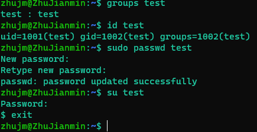  

使用usermod username -g groupname可以添加目标用户所属的用户组

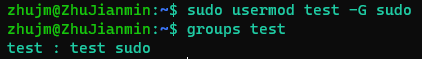 

usermod其他参数

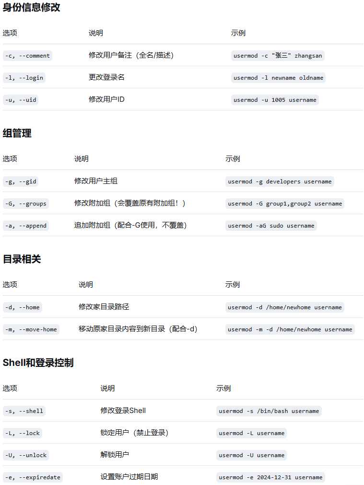 

用户组、用户密码等信息放在etc/passwd、etc/group、etc/shadow等文件夹中

#### 进程管理、资源监控相关

设置服务开机启动

``` bash
sudo systemctl enable servicename
sudo systemctl is-enabled servicename
```

查看指定服务的日志

```sh
journalctl -u servicename -e #-e可以定位当前到日志末尾
```

Linux **top** 是一个在 Linux 和其他类Unix系统上常用的实时系统监控工具。它提供了一个动态的、交互式的实时视图，显示系统的整体性能信息以及正在运行的进程的相关信息，具体包括**CPU、内存**使用情况，q按键可以退出，f按键可以勾选更多列

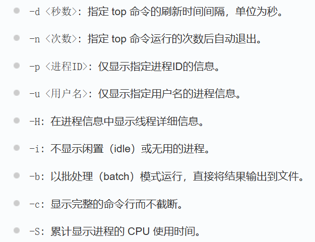 

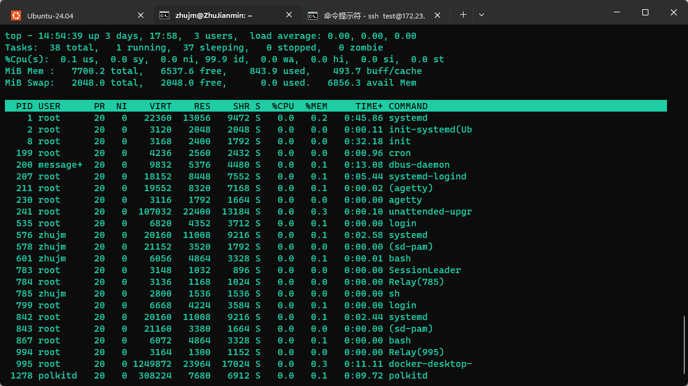

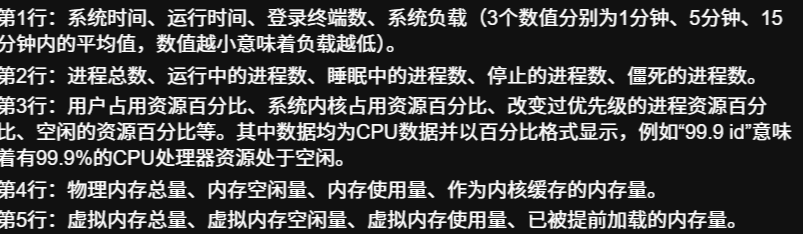 

进程列表表头：PR优先级，NI友好值（越高越容易把CPU执行权让给其他进程），VIRT虚拟内存，RES驻留内存，SHR共享内存，S进程状态

htop

top的升级版，可以按需求排序进程列表，可以用鼠标操作，展示进程树等，还可以对进程列表搜索、过滤，显示线程作用，查看打开的文件，跟踪进程的系统调用

https://www.bilibili.com/video/BV1LwFfe2EtM/?spm_id_from=333.337.search-card.all.click&vd_source=eae2f511976ee44b67dde481a31be83b

uptime

查看系统负载情况

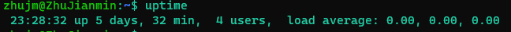 

free命令

可以查看系统内存和交换内存使用情况

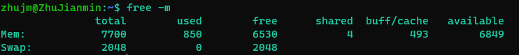 

lsblk命令、df命令

lsblk查看块设备信息，包括硬盘、光驱等

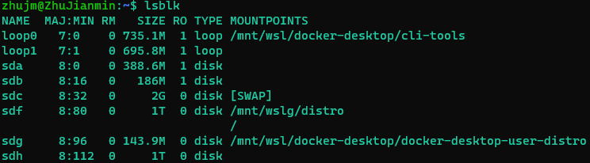 

df查看磁盘使用情况

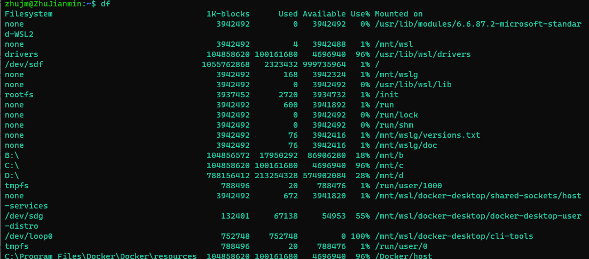 

ps命令、kill命令

查看进程运行情况

- -ef 查看所有进程完整信息
- -aux 查看进程完整信息
  - -a 显示所有进程（包括其他用户的进程） -u 用户以及其他详细信息 -x 显示没有控制终端的进程（有的进程不是从终端启动运行在后台）

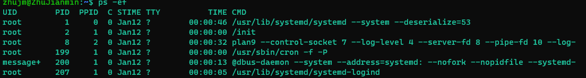

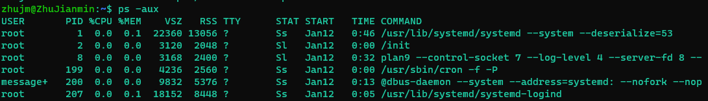

kill命令的参数，kill的第二个参数为PID，用于终止某个PID的进程

- 1 (HUP)：重新加载进程。
- 9 (KILL)：杀死一个进程。
- 15 (TERM)：正常停止一个进程，可以被捕获或忽略

killall可以根据服务名终止与之对应的所有进程

lsof命令

lsof用于列出当前系统打开的所有文件及相关进程信

- -c <进程名>  显示指定进程打开的文件
- -p <PID> 显示指定进程 ID 打开的文件
- +D <目录> 递归显示目录下被打开的文件
- -i :<端口号> 显示网络连接相关信息

#### 文件与文件系统

常见文件目录

usr(Unix System Resource)用来存放系统第三方软件，这里说的第三方由包管理器来管理，opt用来存放商业独立软件，前者一般要遵循更严格的unix软件规范，且需要root权限，当系统更新时这些软件也会一起更新

sbin用来存放超级用户的指令文件

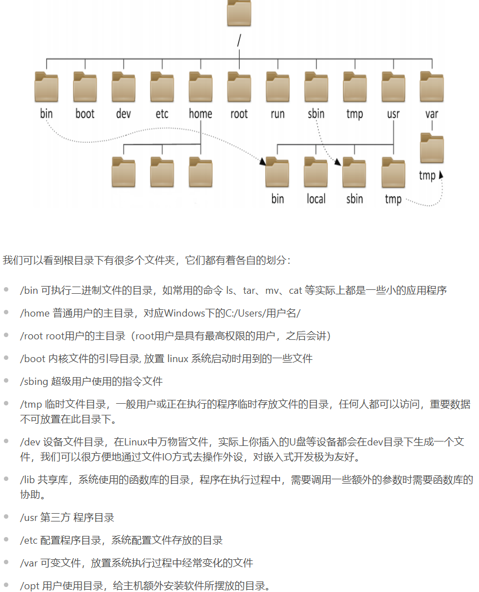 

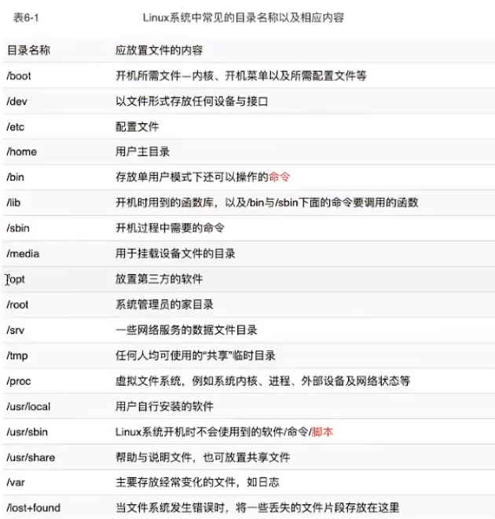 

文件的list

- ls
- ll

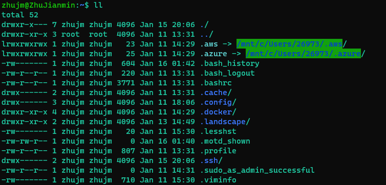 

第1个字符表示此文件的类型：`-`表示普通文件，`l`为链接文件，`d`表示目录（文件夹），`c`表示字符设备、`b`表示块设备，还有`p`有名管道、`f`堆栈文件、`s`套接字等，这些一般都是用于进程之间通信使用的。

第2-4个字符表示文件的拥有者（User）对该文件的权限，第5-7个字符表示文件所属用户组（Group）内用户对该文件的权限，最后8-10个字符表示其他用户（Other）对该文件的权限。其中`r`为读权限、`w`为写权限、`x`为执行权限。

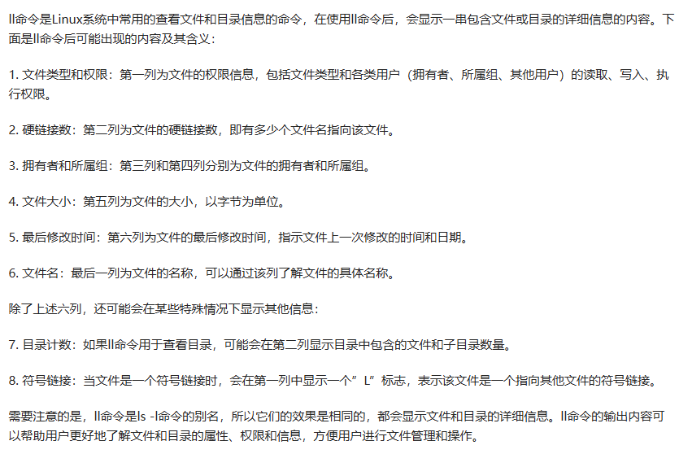 

修改文件所属用户使用chown，修改所属组用chgrp，修改文件权限用chmod

```bash
sudo chown username filename
sudo chgrp groupname filename
sudo chown username:groupname filename #既修改所属用户也修改所属组
chmod  777 filename
```

文件的增删改查

``` bash
# touch命令用于修改文件或者目录的时间属性，包括存取时间和更改时间。若文件不存在，系统会建立一个新的文件
touch filename
# 创建新文件夹
dkdir newDir
# 复制文件到指定路径，如果是复制文件夹注意加上-r参数表示递归操作
cp tarPath srcFile
# 移动文件，和复制类似,mv还用于给文件重命名
mv tarPath srcFile
mv oldNmae newName
# 删除文件、文件夹,文件夹记得用-r参数
rm tarFile
```

压缩解压文件

使用`tar`命令来完成文件亚索和解压操作，在Linux中比较常用的是gzip格式，后缀名一般为.gz，tar命令的参数-c表示对文件进行压缩，创建新的压缩文件，-x表示进行解压操作，-z表示以gzip格式进行操作，-v可以在处理过程中输出一些日志信息，-f表示对普通文件进行操作

```bash
# 压缩
tar -zcvf test.tar.gz test/
# 解压缩
tar -zxvf test.tar.gz 
```


#### 远程控制免密登录SSH、不间断会话服务

原理：用“数字签名”替代“密码传输”，本质上是ssh-server保存了对应的公钥，client请求免密登录时相当于是server请求client发送数字签名，如果签名成功就能认证client的身份，免密登录是对client身份的信任

在linux系统安装openssh-server

```shell
sudo apt install openssh-server
```

在windows安装OpenSSH.Client

```shell
Add-WindowsCapability -Online -Name OpenSSH.Client~~~~0.0.1.0
```

生成rsa密钥，执行完可以去.ssh文件夹下检查是否有文件id_rsa.pub和id_rsa.pub

```shel
sudo ssh-keygen -t rsa -b 4096 -f /etc/ssh/ssh_host_rsa_key -N ""
```

将公钥copy到ssh server，注意如果是windows系统，用git bash去执行以下命令

```bash
ssh-copy-id 用户名@Linux的IP地址
```

此后使用ssh user@host登录ssh server就不需要输入密码了

scp可以帮助远程传输文件

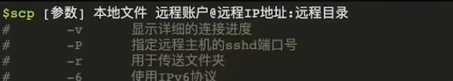 

``` bash
scp -vr srcFile username@host:tarPath
```

rsync作用和scp相同，不过更加智能，具体体现在增量同步、端点续传（--partial选项）、一致性验证

```bash
rsync -avzR -e srcFile username@host:tarPath
```

**不间断会话服务**指的是能够在终端会话中断后**保持进程持续运行**的服务或工具。最典型的代表是 **screen** 和 **tmux**，它们允许你在断开SSH连接后，让会话和其中的程序继续在服务器上运行，之后可以重新连接并恢复工作。

screen 是一个多任务窗口管理器，它允许用户在单个终端窗口中创建多个会话，并在这些会话之间进行切换。它的最大特点是可以将正在运行的会话“脱离”当前的终端窗口，即使用户断开连接或者关闭终端（或者detach离开会话），会话依然保持运行，用户可以在稍后重新连接并继续操作。对于那些需要在后台运行长时间任务的用户来说，screen 提供了极大的便利。

``` bash
screen -S sessionName #新建会话
screen -ls #查看当前所有会话
screen -r sessionName #回到指定会话
```

快捷键ctrl a d（先按Ctrl a，松开a按d）可以detach当前会话。

除了后台运行&符号、screen不间断会话服务，还有**nohup**命令（no hang up，hang up就是挂断信号）也可以实现**后台运行**功能，nohup本身并不会退出命令运行状态，经常配合&一起使用，和screen会话中的进程一样，没有控制终端，关闭终端仍可以运行。

nohub 修饰的命令对输入输出流做了特殊处理，忽略掉输入，并将输出重定向到当前目录下的nohup.out文件下

``` bash
nohup command &
# 等价于：
command < /dev/null > nohup.out 2>&1 &
```

除了不间断会话服务中的进程、nohub命令外还有**守护进程**也是后台运行的

向日葵的安装

[Ubuntu 24.04上安装并使用向日葵完整指南-CSDN博客](https://blog.csdn.net/m0_69493559/article/details/148482302)

#### 实用命令、快捷键

- pwd 打印当前路径
- reboot 关机
- poweroff now -r 立刻重启
- date 获取当前时间
- which 定位可执行文件的位置
- whereis 查找目标文件的位置
- pwd 打印当前工作路径
- wget 根据url下载内容，-b后台下载，-c断点续传，-r递归下载，-P 下载到指定目录
- man 查看命令手册
- wc 统计字数、行数、字节数、字符数等
- history 查看所有历史命令
  - history -c 清除所有历史命令
- Ctrl r，搜索历史命令
- cat 连接输入到输出，默认以终端输入输出
- more 分页显示的cat
- watch 定期执行命令并全屏显示结果，常用于监控系统状态和日志（默认是每隔2s）
- stat <file> 显示文件元信息
- grep <exp> <file> 查找文件里符合条件的字符串或正则表达式
  - `-i`：忽略大小写进行匹配。
  - `-v`：反向查找，只打印不匹配的行。
  - `-n`：显示匹配行的行号。
  - `-r`：递归查找子目录中的文件。
  - `-l`：只打印匹配的文件名。
  - `-c`：只打印匹配的行数
- head/tail [countLine] <file>   查看纯文本文件前/后n行
- tail -f <file>     能够持续刷新一个文件的内容
- tee 读取标准输入，输出到指定文件

  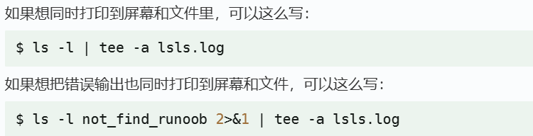 
- ;    表示每个命令按照从左到右的顺序来执行，每个命令彼此之间无任何关联，所有命令都要执行

快捷键

- Tab 自动补全命令、文件名
- ctrl d 终止输入
- ctrl l 清屏
- Ctrl+r快捷键 在Linux中使用 Ctrl+r 可以进入反向搜索模式，在该模式下，输入关键字会搜索之前输入的命令历史记录，并显示最近一次匹配该关键字的命令。若想查找上一条匹配，可以重复按下 Ctrl+r, 直到找到所需的命令为止。另外，也可以按下Enter键执行当前匹配的命令

#### 管道符

重定向

|是最常见最基础的管道符，即前面内容的输出作为后面内容的输入

一般键盘作为输入流，屏幕终端界面作为输出流，也可以重定向这些流

``` bash
# 将标准输出hello重定向到文件中
echo hello > hello.txt
# 将标准输出流追加到目标文件
echo hello >> hello.txt
# 将标准输出hello追加到文件内容中
echo hello > hello.txt
# 将文件作为命令的标准输入
cat < hello.txt
# <、>等符号从左到右先后执行
cat < hello.txt > newHello.txt
# << 表示here document，将多行文本作为stdin，遇到指定标志结束输入
cat << END
# <<< 表示here string，直接将<<< 后面的内容输出
cat <<< 'hello world'
# 写入文件示例
cat << END
{
 
  "registry-mirrors": ["https://registry.docker-cn.com"]
 
}
END
>> /etc/docker/daemon.json
```

输出流重定向默认是将标准输出流重定向，当在>的左边加上数字2时，此时是将报错信息重定向到>的右边；如果在>的右边再加上&则会将标准输出和错误输出共同追加到文件的末尾

``` bash
# 若x.txt不存在，则会直接报错permission denie
echo hello > x.txt
# 如下，重定向错误束流时，报错信息会保存到hello.txt
zhujm@ZhuJianmin:/opt$ ll x 2> hello.txt
zhujm@ZhuJianmin:/opt$ cat hello.txt
ls: cannot access 'x': No such file or directory
```

管道符&1指向当前输出本身，本质上是引用文件描述符

``` bash
# 示例1：stderr 和 stdout 都输出到终端
command 2>&1
# 等价于：
# stderr → 终端
# stdout → 终端

# 示例2：stderr 跟着 stdout 进入文件
command > output.log 2>&1
# 执行顺序：
# 1. stdout → output.log
# 2. stderr → stdout（也就是 output.log）
# 结果：两者都进入 output.log

# 示例3：顺序很重要！
command 2>&1 > output.log
# 执行顺序：
# 1. stderr → stdout（当前是终端）
# 2. stdout → output.log
# 结果：stderr 输出到终端，stdout 到文件 ❌
```

grep 实用参数-a -10	找到内容后续10行也一并显示

#### 环境变量

命令的类别和识别顺序

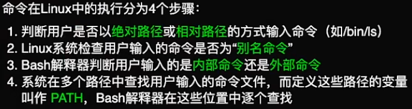 

命令在linux中的执行顺序，这里提到的别名命令涉及到alias、unalias命令。

使用type命令可以获取目标命令的类别

$指向环境变量，用冒号分隔开。环境变量保存在.bashrc、文件中，$变量名指向变量值

 ```bash
 $ echo $PATH
 /usr/local/sbin:/usr/local/bin:/usr/sbin:/usr/bin:/sbin:/bin:/usr/games:/usr/local/games:/snap/bin
 ```

临时变量的使用

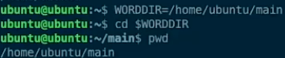 

``` bash
# 设置多个变量
export VAR1=value1 VAR2=value2
```

设置永久环境变量

修改 `~/.bashrc`或`.bash_profile` 文件（二者生效的时机各不相同，前者在打开终端时生效，后者在登录时生效），在末尾添加EXPORT语句，保存后要用source命令使配置生效。

``` bash
vim ~/.bashrc
# 在末尾添加
export MY_VAR="value"
export PATH=$PATH:/path/to/your/directory
source ~/.bashrc
```

#### shell

bash命令执行脚本

```
bash xx.sh
```

bash执行字符串内容

```bash
bash -c '...'
```

shell脚本的执行，&是放在命令的尾部空格后面

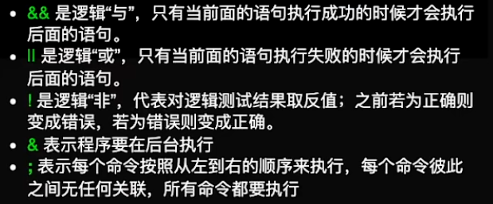 

本质上是开启了一个新的shell，如果希望在当前进程执行sh脚本内容，可以使用source命令

####  JSON工具jq

基本使用

```bash
# 基本格式：将JSON数据通过管道（|）传递给 jq 进行处理
cat data.json | jq [选项] '过滤器'
# 最常见的：纯美化输出（过滤器就是一个点 . ）
jq . data.json
```

常用参数

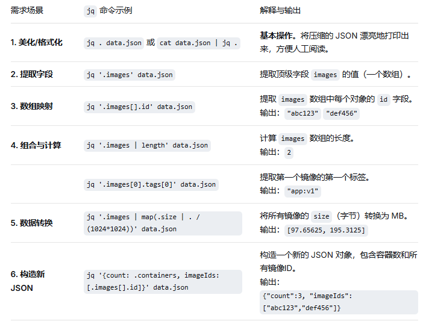  

#### netstat

最常用的找端口对应进程信息的命令ss -tlnp

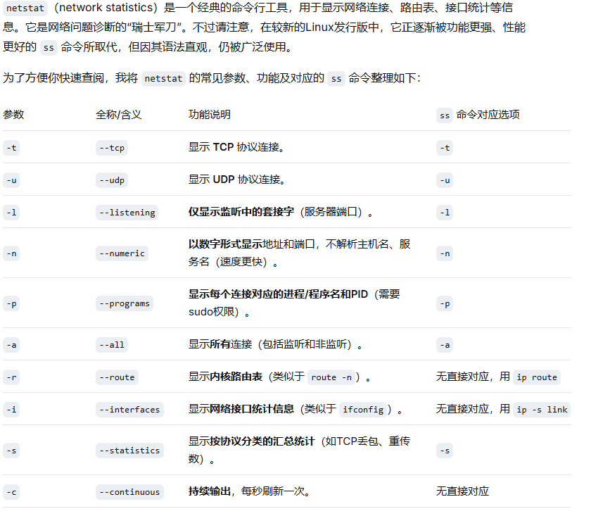防火墙放行端口命令

```bash
sudo ufw allow port/tcp
sudo ufw reload
```

