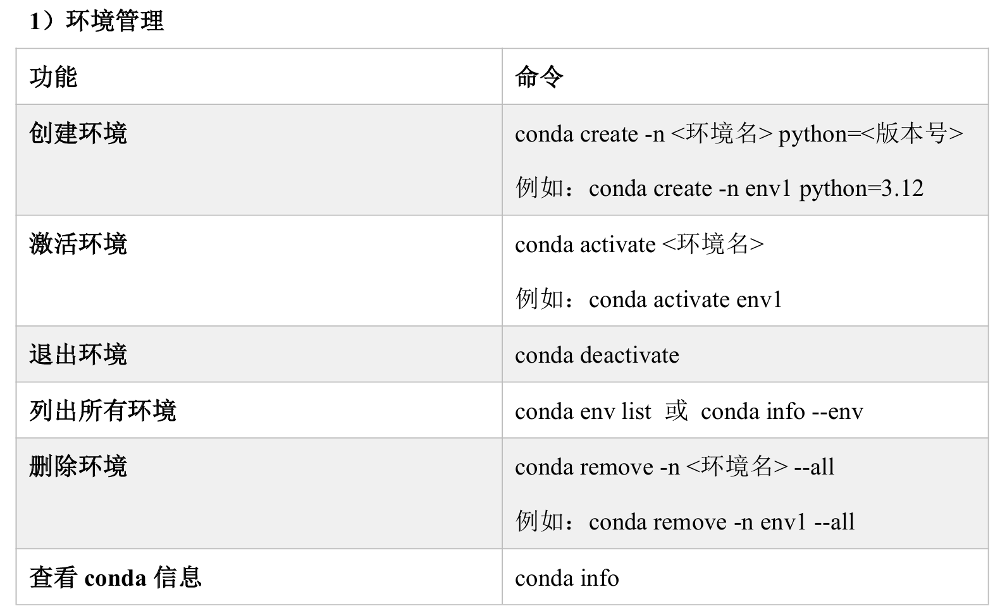
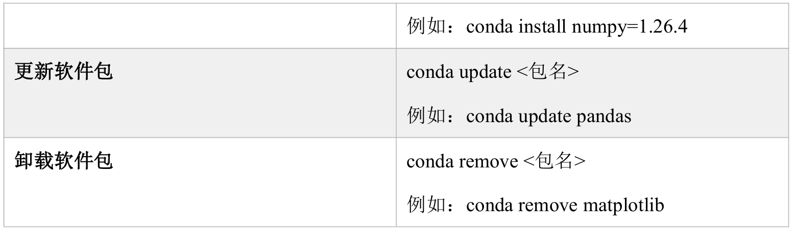
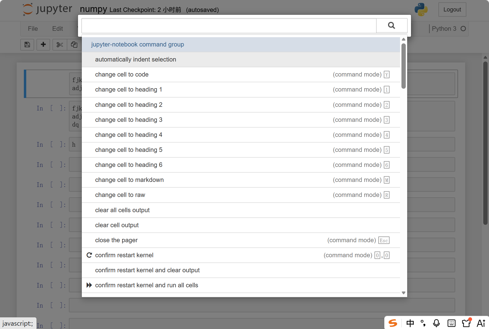
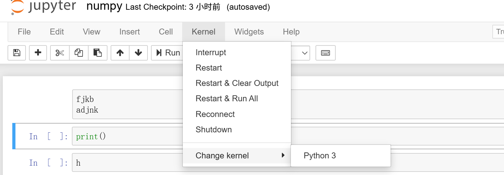
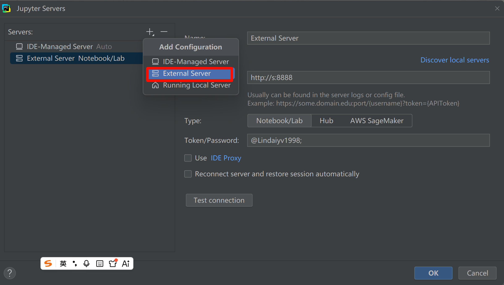
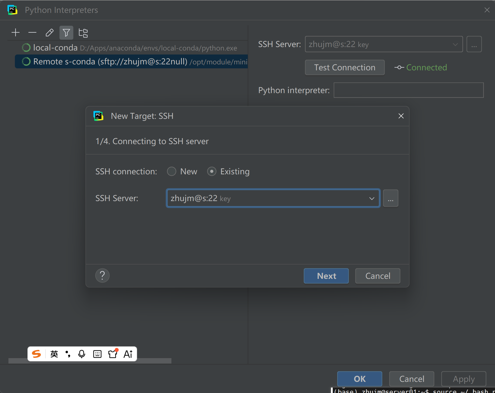
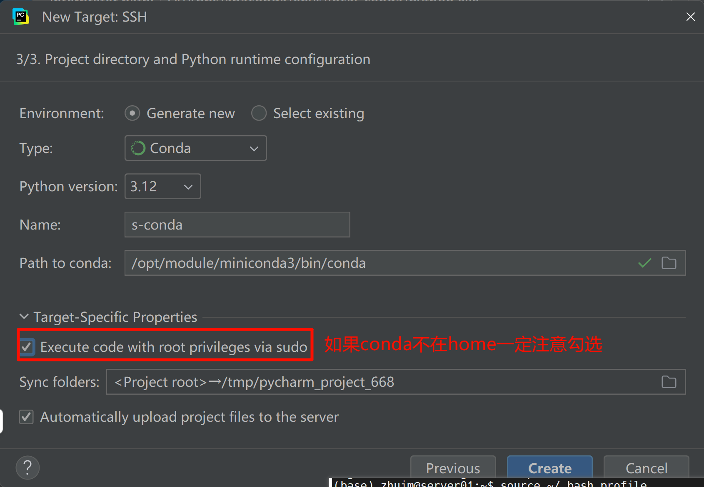
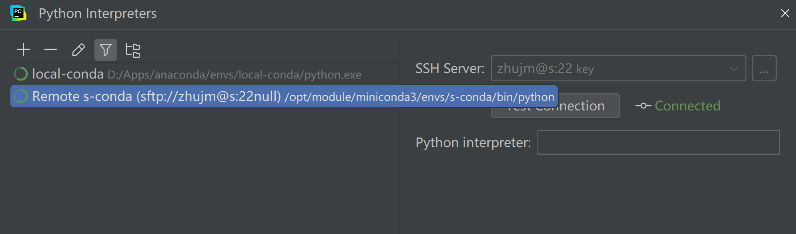
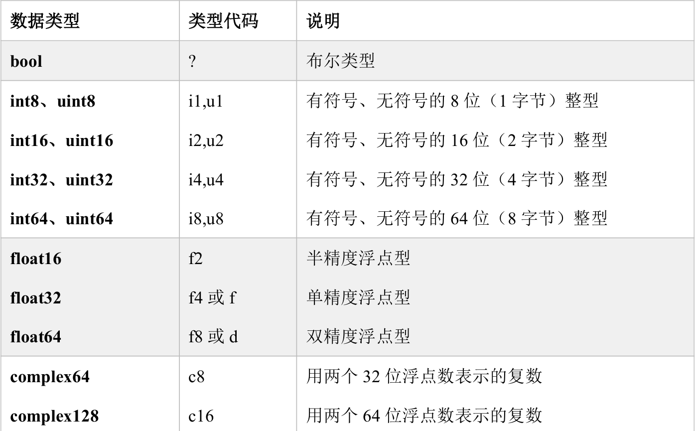
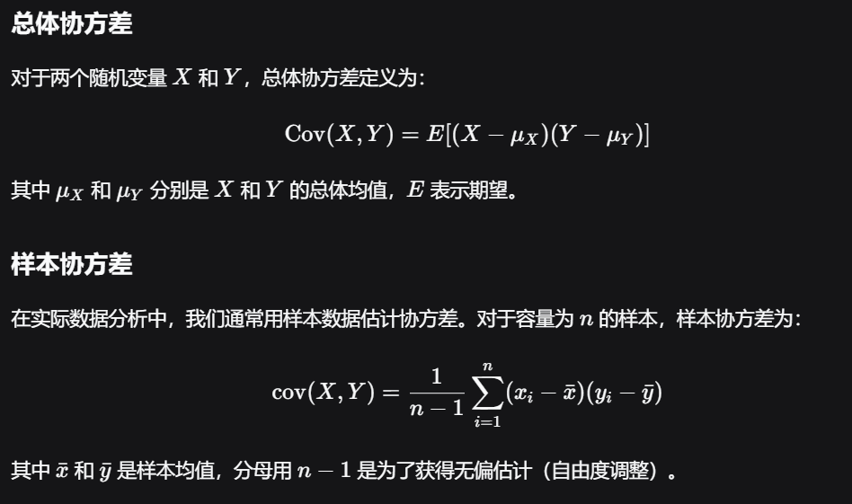

### anaconda+jupyter：新的开发环境

#### anoconda、jupyter环境

Anaconda是一个**专注于数据科学和机器学习领域的 Python（和R语言）发行版**，它的核心目标是提供一个“开箱即用”的、稳定且高效的开发环境。它就像一个全能工具箱，让你不必再为安装和管理各种复杂的软件包而烦恼。Anacconda可以直观地理解为：**Anaconda = 解释器 + 依赖管理工具 (Conda) + 预安装工具包 (Python/R + 常用库) + 集成工作台 (Navigator/Jupyter**等)。  

`Jupyter`是一个庞大的开源项目，其名字源自它最初支持的三种核心编程语言：Julia、Python 和 R。如今，它已发展为一个支持超过100种编程语言的交互式计算平台 。它的核心是**计算叙事**的理念，即将`代码`、运行结果、`可视化图表`和`解释性文本`融合在一个单一文档——**Notebook** 中

- `Jupyter Notebook` (经典界面)：这是最初的Web应用程序，提供了简洁、以文档为中心的体验，非常适合创建和分享包含代码、方程、可视化和叙述性文本的计算文档 。
- `JupyterLab` (下一代界面**)**：作为当前更`主流的开发环境`，JupyterLab 提供了一个功能更强大、布局更灵活的集成开发环境。你可以同时打开 Notebook、代码文件、终端、数据文件等，并随意拖放排列，就像 IDE 一样 。
- `JupyterHub`：这是一个`多用户版本`，允许组织为成百上千的用户（如公司团队、教室里的学生）集中部署和管理 Jupyter 环境，每个人都能通过浏览器访问自己的专属服务器 。
- Jupyter 内核 (`Kernels`)：内核是 Notebook 的心脏，它是一个独立的进程，负责执行用户编写的代码，并将结果返回给界面。Jupyter 的强大之处在于其语言无关性，你可以通过安装不同内核（如 `IRkernel` 用于 R 语言），在同一个 Notebook 界面中编写和运行多种语言

Jupyter 之所以能在算法和数据开发中占据核心地位，源于它完美契合了这一领域**探索性、迭代性和协作性**的工作特点。

安装步骤

[anaconda | 镜像站使用帮助 | 清华大学开源软件镜像站 | Tsinghua Open Source Mirror](https://mirrors.tuna.tsinghua.edu.cn/help/anaconda/)

安装完成后在开始菜单查看，可以看到现在完整版的conda支持以下内容包括jupyter

 

#### conda常用命令

    

 

   

conda查看包可用版本	

```sh
conda search 包名
```

conda更新包时禁止更新当前包的依赖

```sh
conda install 包名=版本号 --no-update-deps
```

#### Jupeter常用快捷键和基本使用

- Esc进入命令模式，Enter进入当前cell的编辑模式

- 点击“键盘”图标可以打开命令面板，可以利用该面板执行操作

  

- 命令模式

  - Ctrl + Enter运行cell，Shift + Enter运行cell并选中下面一个cell，Alt + cell运行cell并在下方插入一个新cell
  - a在上方插入cell，b在下方插入cell，dd删除当前cell
  - m将cell设置为markdown模式，y将cell设置为代码模式
  - space/shift+space 向下/向上滚动页面
  - h查看快捷键帮助

- 编辑模式

  - tab 缩进或代码补全
  - Ctrl + ] 缩进选中的代码，Ctrl + [ 向左缩进选中的代码
  - ctrl + shift + -，在当前光标位置将cell分为两个cell
  - shift + tab，把光标放在函数调用处的后面或参数位置，可以查看该函数的文档

ipynb文件导出为markdown

```sh
conda install nbconvert
conda run python -m nbconvert --to markdown target_file
```

jupyter 代码提示功能，安装完以下包后重启jupyter服务即可

```py
conda install jupyterlab-lsp python-lsp-server[all]
```

#### 配置远程jupyter服务

**jupyter远程服务**

一般把jupyter server放在linux环境上，就jupyerhub而言，linux环境下的不同用户远程登录jupyter会分配不同的运行空间，对应**不同的`kernal`进程**（py进程），这样做有很多好处

- 权限控制明晰，一般而言用户就只能在家目录工作
- linux环境本身支持和部署环境一致
- 支持数据直接操作和大数据组件生态
- 资源控制清晰，给每个进程分配配额的资源
- 不同kernal网络端口隔离

在linux安装好anaconda后用`jupyter lab`命令启动服务后，默认只运行本地访问，因此如要实现使用jupyter远程服务运行前有必要做一下准备

```bash
# 生成jpt配置文件，~/.jupyter/jupyter_server_config.py
jupyter server --generate-config

# 生成密码
conda activate your_env_name # 激活环境
from jupyter_server.auth import passwd
passwd() # 生成密码得到一串哈希值，

# 在配置文件添加以下内容，根据自己是jupyter notebook还是lab自行修改前缀
# 允许远程访问
c.ServerApp.allow_remote_access = True
# 监听所有网络接口，允许任何IP连接
c.ServerApp.ip = '0.0.0.0'
# 启动时不要自动打开浏览器
c.ServerApp.open_browser = False
# 设置你刚刚生成的密码哈希值
c.PasswordIdentityProvider.hashed_password = '粘贴你生成的argon2密码哈希值'
# （可选）设置JupyterLab的启动目录，例如 /home/your_username
c.ServerApp.root_dir = '/home/your_username'
# （可选）指定一个端口，例如 8888
c.ServerApp.port = 8888
```

如果是jpt hub环境，有必要设置开机自启动，新建文件/etc/systemd/system/jupyter.service

```bash
[Unit]
Description=Jupyter lab (Anaconda)
After=network.target

[Service]
Type=simple
User=linuxuser
WorkingDirectory=/home/linuxuser
# 关键：通过bash激活conda环境后再启动jupyter
ExecStart=/bin/bash -c ". anaconda3安装位置/etc/profile.d/conda.sh && conda activate 环境名称 && exec jupyter lab --config=/home/用户名称/.jupyter/jupyter_server_config.py"
Restart=always
RestartSec=10

[Install]
WantedBy=multi-user.target
```

```bash
sudo systemctl daemon-reload
systemctl enable jupyter
```

必要地，还需为jupyter服务提供SSL保护，并将不同的conda env注册到jupyter kernal。具体做法不做详细展开。

```bash
# 修改jupyter_notebook_config.py
# 指定私钥文件路径
c.JupyterHub.ssl_key = '/path/to/your/private.key'
# 指定证书文件路径
c.JupyterHub.ssl_cert = '/path/to/your/certificate.crt'
```

```py
# 激活环境后设置到jpt kernal
python -m ipykernel install --user --name="env_name" --display-name="kernal_name"
```

 

**pycharm集成jupyter**

pycharm作为功能强大的IDE尤其不可替代性，比如强大的代码提示能力，因此可以考虑让pycharm集成远程jupyter服务，同时具备ide功能和代码运行结果记录、笔记书写的功能

设置Jupyter Server



**设置conda解释器**

这里需要注意pycharm远程使用conda解释器无法同意conda的协议，需要按照报错的提示在终端执行命令同意协议

此外，conda的启动要用到环境变量，而pycharm这边是没法找到远程的环境变量的，因此需要添加.bashrc_profile文件给远程登录的一方找到环境变量
[( Linux文件 profile、bashrc、bash_profile区别 - 知乎](https://zhuanlan.zhihu.com/p/405174594)

```bash
echo "test -f ~/.bashrc && source ~/.bashrc" > ~/.bash_profile
source  ~/.bash_profile
```

这样再去添加ssh外部解释器就可以找到conda解释器位置了







### Numpy

#### numpy基础

NumPy（**Numerical Python**）是Python语言中用于科学计算的核心库。它提供了高性能的多维数组对象以及处理这些数组的工具，是数据分析、机器学习、图像处理等领域不可或缺的基础库。几乎所有更高层的科学计算库（如SciPy、Pandas、Matplotlib、scikit-learn等）都建立在NumPy之上

numpy 的部分功能如下： 

- ndarray，一个具有矢量算术运算和复杂广播能力的快速且节省空间的多维数组。 
- 用于对整组数据进行快速运算的标准数学函数（无需编写循环）。 
- 用于读写磁盘数据的工具以及用于操作内存映射文件的工具。  线性代数、随机数生成以及傅里叶变换功能。
- 用于集成由C、C++、Fortran等语言编写的代码的API。

#### ndarray

`ndarray`，即N维数组对象，是NumPy库中最核心、最重要的数据结构。你可以把它理解为一个高性能的、同质的多维数组容器，是Python中进行科学计算和数据分析的基石

ndarray和python的list的区别

- 长度固定，不允许append、remove操作
- 每个维度上的大小一致，即**Rectangular** 
- 元素的数据类型必须一致
- 所有操作方法面向数组元素而非数组结构，数组结构一旦确定无法改变
- 切片行为返回是"视图"而非副本，对视图的操作会影响原数组
- 面向数据集的数值计算性能高，因为ndarray本质上是元素连续存储，而list是指针连续存储

ndarray支持的元素类型

  

#### ndarray操作相关代码练习

见 [ndarray_prac.ipynb](ndarray_prac.ipynb) 

### Pandas

#### pandas概述

Pandas 是 Python 数据分析领域的核心库，由 Wes McKinney 于 2008 年创建，主要用于数据处理和分析。它基于 NumPy 构建，提供了高效、灵活的数据结构，使得处理结构化数据变得简单直观。无论是数据清洗、转换、聚合，还是与可视化、机器学习库的集成，pandas 都扮演着不可或缺的角色。

pandas 引入两种主要数据结构：

- **Series**：一维带标签数组，可以存储任意数据类型（整数、浮点、字符串、Python 对象等）。标签（索引）使得数据访问更灵活。
- **DataFrame**：二维表格型数据结构，由行和列组成，每一列可以是不同的数据类型。DataFrame 既有行索引也有列索引，类似于 Excel 表或 SQL 表。

这两种结构的设计使得数据操作更加符合直觉，同时也具备良好的性能。

pandas支持的功能

  

#### series

series和ndarray的对比


#### series相关方法代码实践

见 [series_prac.ipynb](series_prac.ipynb) 

#### dataframe

DataFrame 是一种广泛应用于数据分析和处理的数据结构，可以理解为一张二维的表格，类似于 Excel 表格或 SQL 数据库中的表。它由行和列组成，每一列可以是不同的数据类型（如数值、字符串、布尔值等），并且支持对数据进行高效的筛选、变换、聚合和可视化操作


### 统计学基础

#### 几个常见的统计术语

平均值mean

众数mode

分位数quantile

正态分布Normal distribution

相关性系数correlation coefficient

置信度confidence coefficient

#### 分位数

分位数用于描述一组数据的分布情况。简单来说，分位数就是将一组有序数据划分为若干个相等部分的数值点。通过分位数，我们可以了解数据的**分散程度、中心位置以及异常值**等情况。

 

常见分位数

- 四分位数（Quartiles）：将数据分为四等份的三个分位数。
  - 第一四分位数（Q1*Q*1），又称下四分位数，对应 p=0.25*p*=0.25，即25%分位数。
  - 第二四分位数（Q2*Q*2），即中位数，对应 p=0.5*p*=0.5。
  - 第三四分位数（Q3*Q*3），又称上四分位数，对应 p=0.75*p*=0.75。
    四分位数常用于绘制箱线图，展示数据的分布和异常值。

计算分位数的一般方法

 

#### 相关性系数

相关系数是统计学中用于度量两个变量之间线性关系强度和方向的指标。它帮助我们理解一个变量的变化如何与另一个变量的变化相关联，取值范围在 -1 到 1 之间。

- 正相关（系数 > 0）：一个变量增大，另一个也随之增大（如身高与体重）。
- 负相关（系数 < 0）：一个变量增大，另一个反而减小（如汽车速度与行驶时间）。
- 零相关（系数 ≈ 0）：两个变量之间没有线性关系（但仍可能存在非线性关系）。

注意：相关系数只衡量线性关系，不反映因果关系。

皮尔逊相关性系数是最常用的系数公式

 

#### 协方差

用于衡量两个随机变量线性相关程度以及变化方向的指标。它反映了当一个变量**偏离其均值时**，另一个变量如何偏离其均值。与相关系数相比，协方差不仅给出相关方向，还保留了变量的量纲，因此其数值大小受变量单位的影响，通常不易直接比较。

 


