# python基础

### py项目基础

#### 项目创建、管理

poetry

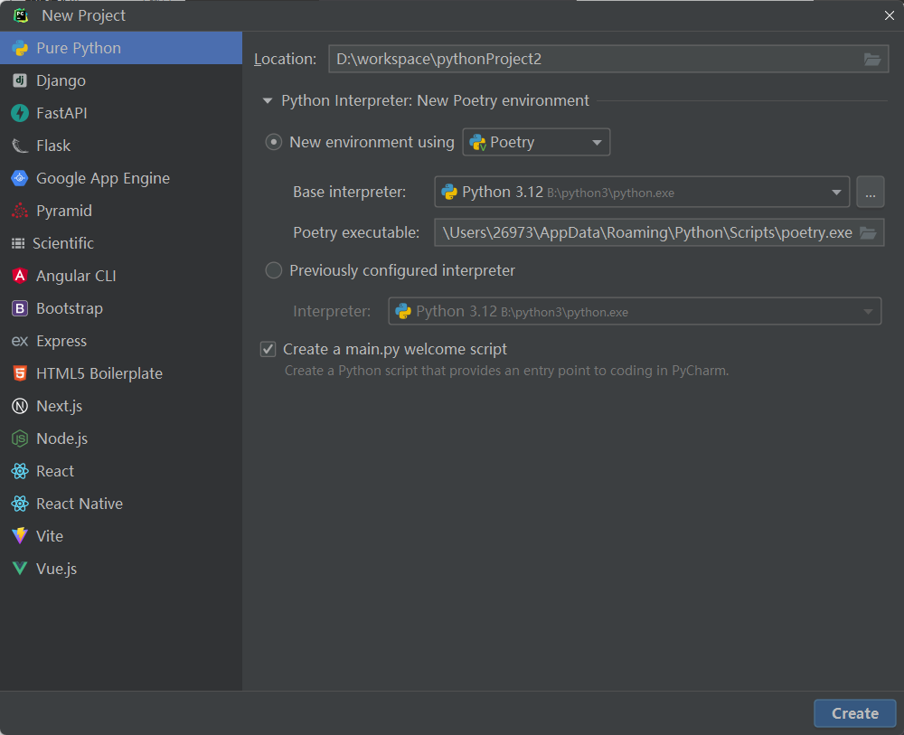

toml文件概述

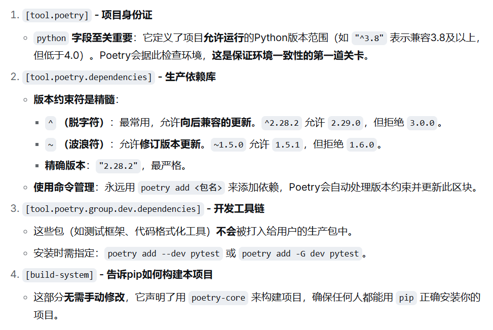 

```toml
# 1. 项目核心元数据 (必须)
[tool.poetry]
name = "my-awesome-project"
version = "0.1.0"
description = "一个用于演示的AI项目"
authors = ["你的名字 <you@example.com>"]
readme = "README.md"
license = "MIT"

# 项目支持的Python版本范围，这是环境一致性的基础！
python = "^3.8"

# 2. 生产依赖声明 (必须)
[tool.poetry.dependencies]
python = "^3.8"
requests = "^2.28.2"     # “^” 表示兼容 2.28.2 及以上但低于 3.0.0
pandas = ">=1.5,<2.0"    # 范围指定，兼容 1.5 到 2.0 之间（不含2.0）
numpy = "*"              # “*” 表示安装任何版本（慎用）
flask = { version = "^2.0", optional = true } # 可选依赖，需手动启用

# 3. 开发依赖声明 (可选，仅用于开发、测试)
[tool.poetry.group.dev.dependencies]
pytest = "^7.0"
black = "^23.0"
jupyter = "^1.0"

# 4. 依赖分组 (Poetry 1.2.0+ 特性，用于组织更复杂的依赖)
[tool.poetry.group.docs.dependencies]
sphinx = "^5.0"

# 5. 构建脚本配置 (可选，定义项目如何被打包)
[build-system]
requires = ["poetry-core"]
build-backend = "poetry.core.masonry.api"
```

管理依赖要在项目的根目录下执行

- poetry add dep_name 添加依赖
- poetry add --dev dep_name 添加生产环境依赖
- poetry add "flask>=2.0,<3.0"  指定版本范围
- poetry add "numpy@^1.21"  兼容1.21及以上，但低于2.0
- poetry add git+https://github.com/some/private.git 从其他源添加

当克隆一个已有Poetry项目，或需要重装环境时

- poetry install --no-dev 一致安装：测试、开发、生产环境一致
- poetry install  根据lock文件安装所有环境的依赖
- poetry lcok 修复lock文件

更新依赖时谨慎更新，先查看具体包的可用情况，在lock文件修改对应版本范围再执行更新，千万不要更新所有依赖到新版本

- poetry show --outdated 查看可用更新
- poetry update dep_name 更新具体包

规范的poetry项目结构

```
your_project/
├── pyproject.toml          # 项目声明（必须）
├── poetry.lock             # 版本锁（必须提交到Git）
├── .gitignore              # 忽略虚拟环境等
├── README.md
├── your_package/           # 你的主要代码
│   ├── __init__.py
│   └── main.py
└── tests/                  # 测试代码
    └── __init__.py
```

#### 命名空间

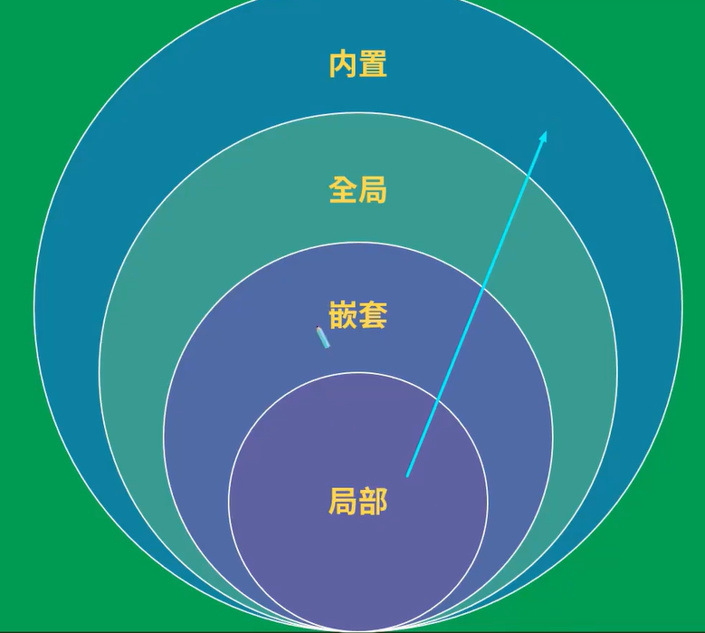 

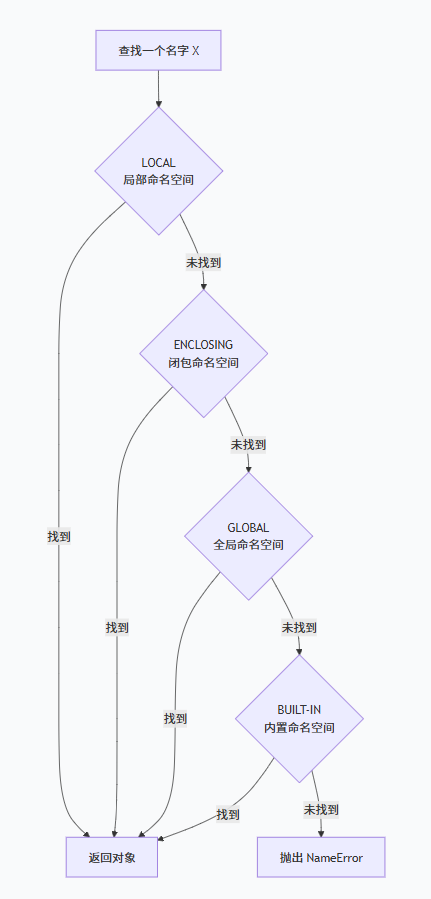 

globals()、locals()

[02.介绍globals和locals_哔哩哔哩_bilibili](https://www.bilibili.com/video/BV1jE411E7zQ?spm_id_from=333.788.videopod.episodes&vd_source=eae2f511976ee44b67dde481a31be83b&p=2)

自动扫描机制

代码在编译时会对当前代码块范围的变量进行扫描，并绑定命名空间

```python
a = 1

def test_local():
    print(a) # 运行此行时直接在局部命名空间查找，不会向上查找
    a = 2 # 编译时认为a是一个局部命名空间变量
```

global关键字

全局变量在方法局部进行修改操作时，解释器认为当前在对局部变量进行修改，未对变量定义、初始化，报错unboundederror。要想达到目的应当，必须在前面使用global关键字说明

```py
a = 1

def test_local():
    global a
    a = 2
```

闭包closure

在一些语言中，在函数中可以（嵌套）定义另一个函数时，如果内部的函数引用了外部的函数的变量，则可能产生闭包。闭包可以用来在一个函数与一组“私有”变量之间创建关联关系。在给定函数被多次调用的过程中，这些私有变量能够保持其持久性。其意义是**提供了一种轻量级的、可维护的“状态封装”方式**

``` python
def outer():
    a = 1
    def inner():
        return a
    return inner()

if __name__ == '__main__':
    print(outer()) # 1
```

如果要查看函数的闭包可以使用\_\_closure__属性访问

使用函数的闭包应当注意几个常见的问题

闭包变量在inner方法中可以读取不能修改，要想修改必须用nolocal关键字声明为nolocal变量。

``` py
# nolocal关键字
def outer_():
    a = 1

    def inner():
        nonlocal a # 缺少将报错
        a = a + 1
        return a

    return inner(), a

if __name__ == '__main__':
    print(outer_())  # (2, 2)
```

在循环中使用闭包容易掉入“变量捕获”的陷阱

```py
# 一个经典的错误示例
funcs = []
for i in range(3):
    def show():
        print(i)
    funcs.append(show)
for f in funcs:
    f()  # 全部输出 2！因为所有闭包共享同一个变量 i 的最终值
# 正确做法：使用默认参数或函数工厂在每次迭代时“冻结” i 的值
funcs = []
for i in range(3):
    def show(x=i):  # 默认参数在定义时求值，绑定当前 i 的值
        print(x)
    funcs.append(show)
```

函数装饰器

```py
def enhance(func):
    def enhance_content():
        print('pre functioning')
        func()
        print('post functioning')
    return enhance_content

# 这里的本质是func = enhance(func)
@enhance
def func():
    print('functioning')

if __name__ == '__main__':
    func()
    # pre functioning
    # functioning
    # post functioning
```

如果要给装饰器指向的函数传递参数，必须在该函数写层"三层嵌套"的形式

```py
def say_hello(msg):
    def outer(func):
        def wrapper(*args, **kwargs):
            print(f'你好，我要开始{msg}计算了')
            return func(*args, **kwargs)
        return wrapper
    return outer

# 装饰加法函数
@say_hello('加法')
def add(x, y, z):
    res = x + y + z
    print(f'{x}和{y}和{z}相加的结果是：{res}')
    return res

# 装饰减法函数
@say_hello('减法')
def sub(x, y):
    res = x - y
    print(f'{x}和{y}相减的结果是：{res}')
    return res

# 测试代码
result1 = add(10, 20, 30)
result2 = sub(20, 10)
'''
你好，我要开始加法计算了
10和20和30相加的结果是：60
你好，我要开始减法计算了
20和10相减的结果是：10
'''
```

如果函数有多个装饰器，按照装饰器位置的先后顺序生效

```py
def decorate1(func):
    def enhance():
        print('pre-enhance1')
        func()
    return enhance

def decorate2(func):
    def enhance():
        print('pre-enhance2')
        func()
    return enhance

@decorate1
@decorate2
def func():
    print('functioning ..')

func()
```

在推导式、生成器表达式当中，解释器会创建新的局部命名空间，表达式当中的变量查找命名空间的顺序和在函数局部命名空间是一样的，因而以下代码的输出预期里a是全局变量a=1

``` py
a = 1
class C:
    a = 2
    x = [a * i for i in range(0,5)]
    print(x) # [0, 1, 2, 3, 4]

if __name__ == '__main__':
    C()
```

导包如果导入完整模块有三种写法，但是建议使用第一种

 

模块的命名空间工作机制：当前文件启动name内置属性为main，被导入则为模块名

```py
# 模拟 Python 解释器如何设置 __name__
def python_interpreter_runs_file(filename):
    """
    模拟 Python 解释器执行模块的过程
    """
    # 1. 创建模块的命名空间
    module_namespace = {
        '__name__': '__main__',  # 直接运行时设置为 '__main__'
        '__file__': filename,
        '__doc__': None
    }
    
    # 2. 如果模块被导入
    if is_imported(filename):
        module_namespace['__name__'] = get_module_name(filename)
    
    # 3. 执行模块代码在这个命名空间中
    exec(module_code, module_namespace)
    
    return module_namespace

# 实际中，Python 解释器内部会处理这些细节
```

#### 基本语法的差异

运算符不支持自增运算符

- 条件表达式可以一定程度替换三目运算符

  ```py
  text = '成年' if age >= 18 else '未成年·'
  ```

- `/` 是标准的、精确的除法，结果总是浮点数（float）。

- `//` 是向下取整除法，结果是一个整数（或浮点数），但总是朝着负无穷的方向取整。

- match-case关键字，作用和switch类似

  ```py
  match code:
      case 1: a = 1
      case 2: a = 2
  ```

- isinstance、issubclass运算符用于判断是否为另一个类的子类
- 连续使用逻辑运算符可以考虑使用all()、any()函数替代

快速迭代函数range(start, stop[, step])

迭代语句的本质是迭代器，以下是自定义迭代器的实现

```py
class MyIterator:
    """自定义迭代器 - 展示迭代器协议"""

    def __init__(self, *args):
        self.data = args
        self.index = 0

    def __iter__(self):
        """迭代器本身也是可迭代的（返回自己）"""
        return self

    def __next__(self):
        """返回下一个元素，或抛出 StopIteration"""
        if self.index >= len(self.data):
            raise StopIteration
        value = self.data[self.index]
        self.index += 1
        return value


# 使用自定义迭代器
my_iter = MyIterator(1, 2, 3)
print("自定义迭代器:")
for item in my_iter:
    print(item)  # 1, 2, 3
```

#### 函数

py的函数允许返回多个返回值，有多个时会自动将他们转为元组

嵌套函数

重要意义是让内部函数独立于全局命名空间

```python
def outer(prefix):
    # 这个工具函数只在outer内部有意义
    def inner(name):
        return f"{prefix}: {name}"
    
    # 使用内部函数
    result = inner("World")
    return result

print(outer("Hello"))  # 输出: Hello: World
# 在全局无法直接调用 inner("World")，因为它被“隐藏”了
```

可变参数

- 使用*形参名来接收任意数量的『位置参数』，多个位置参数最终会被打包成一个『元组』。
- 使用**形参名来接收任意数量的『关键字参数』，多个关键字参数最终会被打包成一个『字典』。

『可变位置参数』和『可变关键字参数』，可以同时使用，但必须要 先写 『可变位置参数 』

``` py
def ff(*args, **kwargs):
    print(args) #('kk', 'ww')
    print(kwargs) #{'k': 'k', 'w': 'w', 'hello': 'world'}
def f(*args, **kwargs):
    print(args) #('kk', 'ww')
    print(kwargs) #{'k': 'k', 'w': 'w', 'hello': 'world'}
    print('______')
    # 注意，使用参数的时候要手动解包，解包的方式就是*、**
    ff(*args,**kwargs)

f('kk', 'ww', k='k', w='w', hello='world')
```

py的函数灵活性非常高，允许在定义完成之后给函数添加函数的局部变量

```py
def welcome():
	print("你好")
# 动态添加属性
welcome.desc = "这是一个用于打招呼的函数"
welcome.version = 1.0
```

py 支持匿名函数/Lambda表达式，注意代码块只能是单个表达式

```py
f = lambda a,b:a + b
print(f(1, 2)) #3
```

函数式编程工具支持map、filter、sorted、reduce等，返回一个迭代器，给可迭代对象的每个元素执行目标函数，不支持链式调用

```py 
# 函数式编程工具函数
from functools import reduce

l = [1, 2, 3]
l = list(map(lambda i: i + 1, l))
print(l)  # [2, 3, 4]
l = list(filter(lambda i: i > 2, l))
print(l)  # [3, 4]
d = [
    {
        'name': '朱建民',
        'age': 28
    },
    {
        'name': '郭大敏',
        'age': 27
    },
    {
        'name': '朱纪雨',
        'age': 26
    }
]
# sorted、max、min等聚合函数
d = sorted(d, key=lambda p: p['age'], reverse=False)
print(d)  # [{'name': '朱纪雨', 'age': 26}, {'name': '郭大敏', 'age': 27}, {'name': '朱建民', 'age': 28}]
sum_age = reduce(lambda a, b: a + b, list(map(lambda person: person.get('age'), d)), 0)
print(sum_age)  # 81
```

#### 数据容器

list

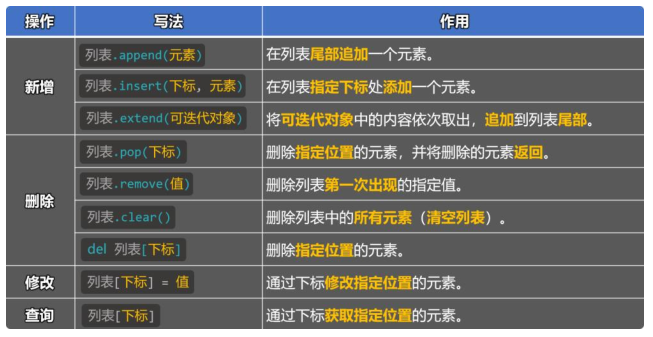 

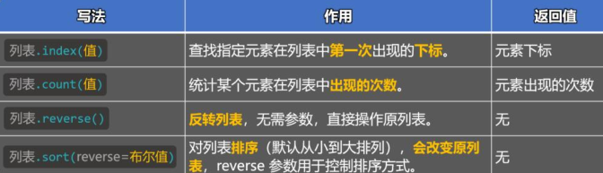 

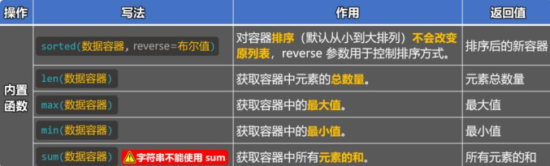  

```py
# 基本增删改查
l = []
l.append(1)
l.append(2)
l.insert(0,0)
ll = [-1]
ll.extend(l)
print(l) #[0, 1, 2]
print(ll) #[-1, 0, 1, 2]
print(ll.pop(1)) #0
print(ll) #[-1, 1, 2]
ll.append(1)
ll.remove(1)
print(ll) #[-1, 2, 1]
del ll[2]
print(ll) #[-1, 2]
ll.clear()
print(ll) #[]

# 顺序、统计操作
print(l.index(1)) #1
l.reverse()
print(l) #[2, 1, 0]
print(l.count(1)) #1
l.sort()
print(l) #[0, 1, 2]

# 数据容器内置函数
# 倒序
l.reverse()
print(l) #[2, 1, 0]
l = sorted(l) #函数本身不会改变参数的容器顺序
print(l) #[0, 1, 2]
# 聚合函数
print(max(l)) #2
print(min(l)) #0
print(len(l)) #3
print(sum(l)) #3
```

in运算符用于判断是否为某个容器的元素

元组

有序集合，内容不可修改。当元组中只有一个元素时，末尾必须写上逗号，否则会被认为是单纯的数字用括号括起来调整优先级

``` py
l = tuple()
l[0] = 1
print(l) #TypeError: 'tuple' object does not support item assignment
```

字符串

- strip 按字符集合移除字符串首尾的字符
-  join 将可迭代对象用原有字符串连接为新字符串
- str和可迭代对象互相转换
  - str(可迭代对象)
  - list(s)
- 注意str不能直接通过+拼接基本数据类型

```py
# str常用方法
# strip删除字符串两端指定字符，如未指定则删除空格
s = '  abbba   '
s = s.strip()
print(s)

# 移除字符的原则是按字符串首尾两端往中间移动，直至下标位置字符不在strip入参字符数组中，停止移除
s = '34215 尚 12 硅 34 谷 4132'
s = s.strip('5432')
print(s)# 15 尚 12 硅 34 谷 41

# 字符串和列表、元组之间互相转换
s = 'abc'
t = tuple(s)
l = list(s)
print(t) #('a', 'b', 'c')
print(l) #['a', 'b', 'c']
ss = ''.join(l)
print(ss) #abc

# join
parts = ["2023", "10", "25"] 
print('-'.join(parts)) #2023-10-25
```

字符串的三种格式化方式

```py
# 字符串的三种格式化用法
print('hello %d %d'%(1,2)) #hello 1 2
print('hello {} {}'.format(1,2)) #hello 1 2
n1 = 1
n2 = 2
print(f'hello {n1} {n2}') #hello 1 2
```

集合是无序、元素唯一的容器，set的元素允许修改，frozenset不允许元素被修改，frozenset只能通过frozenset函数来创建，set可以用字面量定义、创建。

集合要求元素必须是不可变的

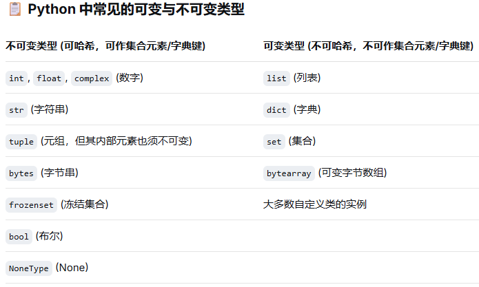 

set支持add、pop、remove、discard、clear等增删操作(frozenset不支持)，修改直接先remove再add，查询有成员运算符in、not in

集合运算：difference支持找出a集合中不在b集合中的元素，difference_update直接删除掉a集合中不在b集合中的元素，union支持合并两个集合，issubset判断是否为b集合的子集，issuperset判断是否为b集合的超集，isdisjoint判断和b集合有无交集。|求并集，&求交集，-求差m，^求对称差

```py
s1 = {10, 20, 30, 40, 50}
s2 = {30, 40, 50, 60, 70}
print(s1.difference(s2)) #{10, 20}

s1 = {10, 20, 30, 40, 50}
s2 = {30, 40, 50, 60, 70}
s1.difference_update(s2)
print(s1) #{20, 10}

s1 = {10, 20, 30, 40, 50}
s2 = {30, 40, 50, 60, 70}
print(s1.union(s2)) #{70, 40, 10, 50, 20, 60, 30}
```

字典dict的新增或修改直接使用d[key] = value即可完成，删除用del关键字，查询用get方法或d[key]，如要批量修改，可以使用update方法

```py
d1.update({'李四': 40, '王五': 67})
```

通过keys()、values()、items()方法可以获取字典的全部键、值、键值对，结果以封装的特殊形式返回

```py
d = {1:2,2:2}
print(d.keys())
print(d.values())
print(d.items())
print(type(d.keys()))
print(type(d.values()))
print(type(d.items()))
# dict_keys([1, 2])
# dict_values([2, 2])
# dict_items([(1, 2), (2, 2)])
# <class 'dict_keys'>
# <class 'dict_values'>
# <class 'dict_items'>
```

列表推导式

用[]包裹简单迭代语句得到列表的语法糖，基本上可以替代map函数

```py 
l = {1, 2, 3}
l = [i + 1 for i in l]
print(l)
```

zip函数可以快速组合两个容器

```py
a = [1, 2, 3]
b = [4, 5, 6]
zipped = zip(a, b)
for i in zipped:
    print(i)
    # (1, 4)
    # (2, 5)
    # (3, 6)
```

enumerate() 函数的效果是给可迭代对象按下标组合得到元组

```py
seasons = ['Spring', 'Summer', 'Fall', 'Winter']
for i in enumerate(seasons):
    print(i)
# (0, 'Spring')
# (1, 'Summer')
# (2, 'Fall')
# (3, 'Winter')
```

#### 面向对象

对象属性在进行声明init方法

```py
def __init__(self, field):
    self.filed = field
```

类方法，可以用来替代构造函数，或者操作类变量

```py
class Man:
    def __init__(self, name, age):
        self.name = name
        self.age = age
    @classmethod
    def from_date(cls, name, age):
        return cls(name, age-1979)

    def getJson(self):
        return {'name':self.name, 'age':self.age}

man = Man.from_date('科比', 2026)
print(man.getJson())
```

注意py的静态方法既没有self入参也没有cls入参，因此没办法访问实例属性也没办法访问类属性，常用于与当前类有关的工具方法

类的继承

子类的init方法形参列表应当大于父类init方法，super()方法可以帮助快速调用父类方法，当然这个父类可以有多个，从给定的MRO顺序选择父类获取目标方法。访问属性时本质上就是查找对象的\_\_dict__属性，调用方法时查找类的mro列表

```python
class Animal:
    branch = 1
    def __init__(self, branch:int):
        self.branch = branch
    def move(self):
        print('I am moving')
        pass

class Dog(Animal):
    def __init__(self, branch:int):
        print(super()) #super() 让你能不必显式地指定父类名字，就能调用父类的方法
        super().__init__(branch) #<super: <class 'Dog'>, <Dog object>>

    def move(self):
        self.run()
    def run(self):
        print('I am running')

dog = Dog(4) #<super: <class 'Dog'>, <Dog object>>
dog.move() #I am running
print(dog.branch) #4
print(dog.__dict__) #{'branch': 4}
print(Dog.mro()) #[<class '__main__.Dog'>, <class '__main__.Animal'>, <class 'object'>]
```

属性的访问权限

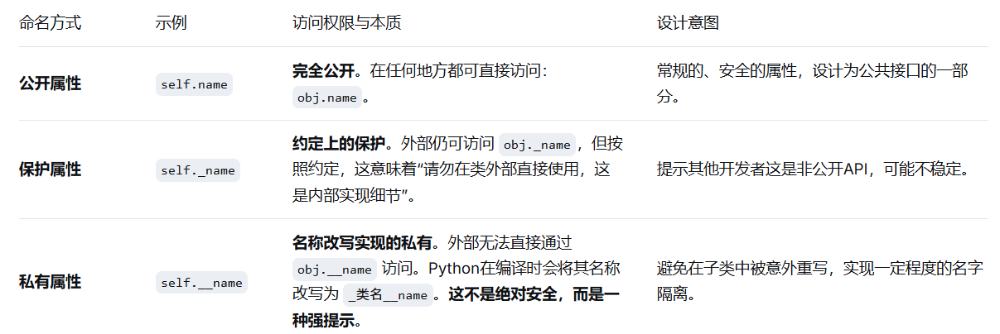 

对于需要真正控制读写权限或计算属性的情况，Python的答案是 **`@property` 装饰器**。它允许你将方法“伪装”成属性，从而实现 **getter、setter、deleter** 逻辑。

```py
class BankAccount:
    def __init__(self, initial_balance):
        self._balance = initial_balance  # 保护属性，存储真实数据

    @property
    def balance(self):
        """balance属性的getter，像访问属性一样读取：account.balance"""
        print("正在查询余额")
        return self._balance

    @balance.setter
    def balance(self, value):
        """balance属性的setter，像赋值一样设置：account.balance = 100"""
        if value < 0:
            raise ValueError("余额不能为负")
        print(f"余额修改: {self._balance} -> {value}")
        self._balance = value

    @balance.deleter
    def balance(self):
        """balance属性的deleter，控制删除操作"""
        print("禁止删除余额属性！")
        # 可以选择不真正删除，或者抛异常

# 使用
account = BankAccount(100)
print(account.balance)     # 触发getter，输出：正在查询余额 \n 100
account.balance = 200      # 触发setter，输出：余额修改: 100 -> 200
# account.balance = -50    # 触发setter，抛出 ValueError: 余额不能为负
del account.balance      # 触发deleter，输出：禁止删除余额属性！
print(account.balance)  #正在查询余额 \n 200
```

魔法函数

“魔法函数”（Magic Methods）或“特殊方法”（Special Methods）是指以**双下划线开头和结尾**的函数（如 `__init__`）,由Python解释器在特定时机（如调用了对应的无下划线的内置函数）自动调用

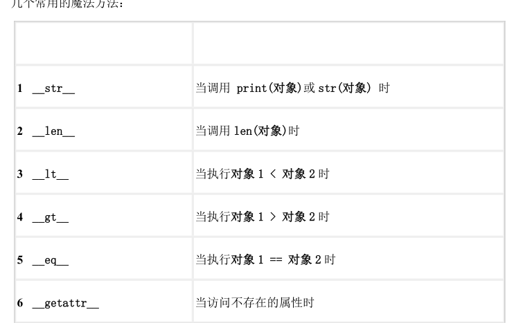 

```py
# 魔法方法
class C:
    def __init__(self, string):
        self.string = string
    def __len__(self):
        print('func inner statement:'+""+str(len(self.string)))
        return len(self.string)

c = C('hello')
print(len(c))
# func inner statement:5
# 5
```

多态重点关注继承过程中不同类的对象使用同名方法的差异

duck-typing -- 鸭子类型
指一种编程风格，它并不依靠查找对象类型来确定其是否具有正确的接口，而是直接调用或使用其方法或属性（“看起来像鸭子，?起来也像鸭子，那么肯定就是鸭子。”）由于强调接口而非特定类型，设计良好的代码可通过允许多态替代来提升灵活性。鸭子类型避免使用  type() 或  isinstance() 检测。(但要注意鸭子类型可以使用 抽象基类 作为补充。) 而往往会采用  hasattr() 检测或是 EAFP编程。

```py
# 多态
class Animal:
    def move(self):
        pass

class Dog(Animal):
    def move(self):
        print('run')

class Bird(Animal):
    def move(self):
        print('fly')

# # 标准多态
# def move(animal:Animal):
#     animal.move()
# 鸭子类型多态
def move(animal:Animal):
    animal.move()

dog=Dog()
bird=Bird()
move(dog) #run
move(bird) #fly
```

py的抽象类中允许已实现的方法存在，通过继承ABC类说明当前类是抽象类，借助@abstractmethod来说明方法时抽象方法。抽象方法必须在子类中得到实现

```py
class AbstractBase(ABC):
    @abstractmethod
    def method(self):
        pass
class ConcretSub(AbstractBase):
    def method(self):
        print('i am implement')

ConcretSub().method()
```

拷贝机制

 copy.copy()提供浅拷贝

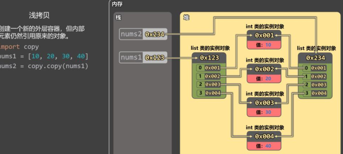 

元素是不可变对象可以完全拷贝，元素是对象，则拷贝的是引用

如果要实现深拷贝需要使用copy.deepcopy函数

函数的传参本质上是值传递，在函数创建对象的副本，如果是不可变对象，本质上是拷贝了其引用，指向的对象空间仍然不变

类装饰器

允许用一个类来装饰另一个函数或类。

装饰函数时，本质上是让函数称为类的函数，当实例被执行时（实例后面跟着()，\_\_call\_\_方法的本质就是让实例像函数一样被调用，创建实例后执行增强的功能），就会触发\_\_call__方法执行，相比于用嵌套函数装饰函数，增强函数的工时还有类的状态的保持

```python
class C:
    def __init__(self, func):
        print('initing ..')
        self.func = func

    def __call__(self, *args, **kwargs):
        print('target function is called ..')
        return self.func(*args, **kwargs)

@C
def func(*arg):
    print(f'functioning with msg: {arg}')

# 本质等价于func = C(func)
# def func():
#     print('functioning ..')
# func = C(func)

print(func)
func('hello world')
# initing ..
# <__main__.C object at 0x0000023C0CF253A0>
# target function is called ..
# functioning with msg: ('hello world',)
```

用类装饰类的话还能增强一个类，使得原有类拥有更多的成员

```py
def add_method(cls):
    """添加一个方法到类中"""

    def extra_method(self):
        return f"这是添加的方法，类名：{cls.__name__}"

    cls.extra_method = extra_method
    return cls

# 等同于MyClass=add_method(MyClass)
@add_method
class MyClass:
    def __init__(self, value):
        self.value = value
    def original_method(self):
        return f"原始方法，值：{self.value}"


# 使用
obj = MyClass(10)
print(obj.original_method())  # 输出：原始方法，值：10
print(obj.extra_method())  # 输出：这是添加的方法，类名：MyClass
```

\_\_str\_\_和_\_repr__

在 Python 中，`__str__` 和 `__repr__` 是两个用于定义对象字符串表示的特殊方法（魔法方法）。它们的主要区别在于目标受众和使用场景。

```py
class Person:
    def __init__(self, name, age):
        self.name = name
        self.age = age

    def __repr__(self):
        return f"Person('{self.name}', {self.age})"

    def __str__(self):
        return f"{self.name} ({self.age} years old)"

p = Person("Alice", 30)

print(repr(p))   # Person('Alice', 30)
print(str(p))    # Alice (30 years old)
print(p)         # 同上（调用 __str__）
# 在交互式环境中：Person('Alice', 30) （调用 __repr__）
p                
```

#### 类型注解

经常有必要给代码添加注解，虽然不会限制数据类型，但是可以极大的提高可读性

```py
from typing import Union

# 变量注解
a: int
a = 1
b: str = ''


# 函数参数注解
def func(n: int) -> (int,int):
    return n, n+1
# def add(*args: int) -> int:
#     return sum(args)
def show_info(**kwargs: str | int):
    print(kwargs)
# 获取函数的注解信息
print(add.__annotations__)

# 容器类型的注解
letter: list[str] = ['a', 'b', 'c']

# Union支持多个类型注解，作用和|类似
hobby: list[Union[str, int]] = ['抽烟', '喝酒', '烫头']
citys: set[str | float | bool] = {'北京', '上海', '深圳'}
# 元组可以给多个具体的元素进行注解
scores: tuple[int, int, int] = (60, 70, 80)
scores: tuple[int, ...] = (60, 70, 80, 90, 100)
scores: tuple[int | str, ...] = (60, '70', 80, '90', 100)
# 字典类型的key、word类型之间用，隔开
persons: dict[str | int, int] = {'张三': 18, '李四': 19, '王五': 20}
```

#### 异常处理机制

py异常体系

``` 
BaseException
 ├── BaseExceptionGroup
 ├── GeneratorExit
 ├── KeyboardInterrupt
 ├── SystemExit
 └── Exception
      ├── ArithmeticError
      │    ├── FloatingPointError
      │    ├── OverflowError
      │    └── ZeroDivisionError
      ├── AssertionError
      ├── AttributeError
      ├── BufferError
      ├── EOFError
      ├── ImportError
      │    └── ModuleNotFoundError
      ├── LookupError
      │    ├── IndexError
      │    └── KeyError
      ├── MemoryError
      ├── NameError
      │    └── UnboundLocalError
      ├── OSError
      │    ├── BlockingIOError
      │    ├── ChildProcessError
      │    ├── ConnectionError
      │    │    ├── BrokenPipeError
      │    │    ├── ConnectionAbortedError
      │    │    ├── ConnectionRefusedError
      │    │    └── ConnectionResetError
      │    ├── FileExistsError
      │    ├── FileNotFoundError
      │    ├── InterruptedError
      │    ├── IsADirectoryError
      │    ├── NotADirectoryError
      │    ├── PermissionError
      │    ├── ProcessLookupError
      │    └── TimeoutError
      ├── ReferenceError
      ├── RuntimeError
      │    ├── NotImplementedError
      │    └── RecursionError
      ├── StopAsyncIteration
      ├── StopIteration
      ├── SyntaxError
      │    └── IndentationError
      │         └── TabError
      ├── SystemError
      ├── TypeError
      ├── ValueError
      │    └── UnicodeError
      │         ├── UnicodeDecodeError
      │         ├── UnicodeEncodeError
      │         └── UnicodeTranslateError
      └── Warning
           ├── DeprecationWarning
           ├── FutureWarning
           ├── UserWarning
           └── ...
```

try、except、finally机制

``` py
try:
    a = 1/0
# 不指明具体异常类型亦可
except:
    print('')

    
try:
    a = 1/0
# 指明具体异常类型
except BaseException:
    print('')


try:
    a = 1/0
# 捕获多个异常
except ValueError:
    print('程序异常：您输入的必须是数字！')
except ZeroDivisionError:
    print('程序异常：0 不能作为除数！')

try:
    a = 1/0
# 捕获多个异常
except (ValueError, ZeroDivisionError) as e:
    match e:
        # 这里的case有个trick，ClassName()在case后面执行并不会创建新的实例
        case ValueError():
            print('程序异常：您输入的必须是数字！')
        case ZeroDivisionError():
            print('程序异常：0 不能作为除数！')


try:
    a = 1/1
except:
    pass
# 不论try语句是否有异常都将执行finally语句
finally:
    print('finally statement ..')
```

如果在try或except中出现了return语句，解释器会先记录返回值，并执行finally语句，最后返回。如果finally语句有return，会用新的返回值覆盖旧的返回值

```py
def func():
    try:
        print(1)
        return 1
        print(2)
    except:
        print('except')
    finally:
        print('finally')
        return 3

if __name__ == '__main__':
    print(func())
    # 1
    # finally
    # 3
```

打印异常情况

- e.args

- e.value

- e.\_\_str__

- 交互式环境下e

  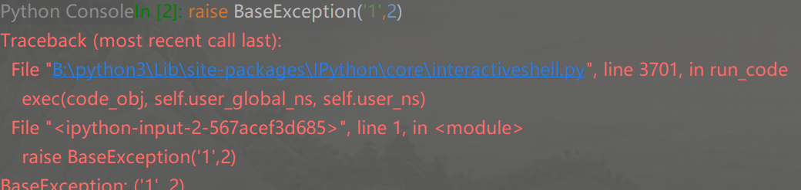 


 `BaseException` 定义了默认的 `__str__` 方法。其行为大致如下：

- 如果异常实例有非空的 `args` 元组（即构造时传入的参数），
  - 当 `len(args) == 1` 时，`__str__` 返回 `str(args[0])`；
  - 当 `len(args) > 1` 时，`__str__` 返回 `repr(args)`（即所有参数的表示）。
- 如果 `args` 为空（即没有提供任何参数），`__str__` 返回空字符串 `''`。

- 打印异常对象e时返回的是e.\_\_str__()

`BaseException` 的 `__repr__` 大致逻辑是：

- 如果异常实例的 `args` 属性（即构造时传入的参数元组）为空，则返回 `f"{self.__class__.__name__}()"`。
- 如果 `args` 有一个参数，则返回 `f"{self.__class__.__name__}({repr(args[0])})"`。
- 如果 `args` 有多个参数，则返回 `f"{self.__class__.__name__}{repr(args)}"`。


所有的py异常都是运行时异常，即都能通过编译。如果未try-except，异常会自动上抛，如果要主动抛出异常，使用raise关键字

```py
>>> raise
Traceback (most recent call last):
  File "<pyshell#1>", line 1, in <module>
    raise
RuntimeError: No active exception to reraise
>>> raise ZeroDivisionError
Traceback (most recent call last):
  File "<pyshell#0>", line 1, in <module>
    raise ZeroDivisionError
ZeroDivisionError
>>> raise ZeroDivisionError("除数不能为零")
Traceback (most recent call last):
  File "<pyshell#2>", line 1, in <module>
    raise ZeroDivisionError("除数不能为零")
ZeroDivisionError: 除数不能为零
```

#### 生成器

1. 生成器函数：函数体中如果出现了 yield 关键字，那该函数是『生成器函数』
2. 生成器对象：调用『生成器函数』时，其函数体不会立刻执行，而是返回一个『生成器对象』
  1. 调用『生成器对象』的__next__方法，会让『生成器函数』中的代码开始执行
  2. 当『生成器函数』中的代码开始执行后，遇到 yield 会“暂停”，并会记录“暂停”的位置
  3. 后续调用__next__方法时，都会从上一次“暂停”的位置，继续运行，直到再次遇到yield

  4. 遇到 return 会抛出 StopIteration 异常，并将 return 后面的表达式，作为异常信息。
  5. yield 后面所写的表达式，会作为本次__next__方法的返回值。

```py
# 生成器函数
def demo():
    print("a ..")
    yield 'a'
    print("b ..")
    yield 'b'
    return 250
# 生成器对象
obj = demo()
# 执行next
print(next(obj))
# a ..
# a
print(next(obj))
# b ..
# b
try:
    next(obj)
except StopIteration as stop_iteration:
    print(stop_iteration) #250

# 本质上生成器函数是通过yield关键字生成了一个迭代器
print(hasattr(obj, '__iter__')) #True
```

yield from 能把一个『可迭代对象』里的东西依次 yield 出去。(替代：for + yield)

```py
def demo():
    nums = [10, 20, 30, 40]
    yield from nums
d = demo()
r1 = next(d)
print(r1)
r2 = next(d)
print(r2)
r3 = next(d)
print(r3)
r4 = next(d)
print(r4)
# 10
# 20
# 30
# 40
```

生成器对象的send(data)方法作用和\_\_next__类似，也是执行到下一处yield，不过还补充了入参值data，yield语句可以接收结果，每次yield接收的结果就是send方法是入参值。需要注意的是，第一次启动生成器，必须使用next启动，或者用send传None

```py
def demo():
    msg = yield '10'
    print(msg)
    yield '20'
d = demo()
r1 = d.send(None)
print(r1)
r2 = d.send('200')
print(r2)
# 10
# 200
# 20
```

用生成器函数实现迭代器

```py
class Person:
    def __init__(self, name, age, gender, address):
        self.name = name
        self.age = age
        self.gender = gender
        self.address = address
        self.__attr = [name, age, gender, address]
    def __iter__(self):
        yield from self.__attr
p1 = Person('张三', 18, '男', '北京昌平')

print(list(p1)) #['张三', 18, '男', '北京昌平']
for attr in p1:
    print(attr)
# 张三
# 18
# 男
# 北京昌平
```

生成器表达式本质上是快速创建生成器对象的方式

```py
result = (n * 2 for n in nums)
```

#### IO

文件的open操作是和close配对使用的，为减少异常处理语句的大量使用，引入with语句，针对对象的配对方法a，调用前使用with关键字，:后面的代码块被执行完成后，对象会自动调用与a对应配对的方法b

```py
with open('/path/to/file', 'r') as f:
    print(f.read())
```

等同于

``` py
try:
    f = open('/path/', 'r')
    print(f.read())
finally:
    if f:
        f.close()
```

py的open函数mode中的修改参数值参考，如要同时读写需要使用+参数，具体组合如下

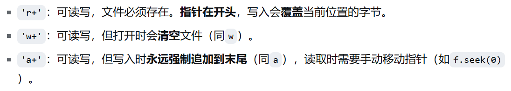

递归扫描路径下的文件和目录

```py
result = os.walk('D:/demo')
for item in result:
	print(item)
```

#### 项目构建与包管理

**pip**

安装pip

```bash
sudo apt install python3-pip
```

设置镜像源

```sh
pip3 config set global.index-url https://pypi.tuna.tsinghua.edu.cn/simple
```

**poetry**

安装poetry

``` sh
# powershell 运行
(Invoke-WebRequest -Uri https://install.python-poetry.org -UseBasicParsing).Content | py -
```

设置镜像源

```sh
# 放在toml最上面
[[tool.poetry.source]]
name = "mirrors"
url = "https://pypi.tuna.tsinghua.edu.cn/simple/"
priority = "primary"
```

创建poetry项目

```sh
poetry new proj-name -n
```

添加依赖

```sh
poetry add modulename
```

移除依赖

```sh
poetry remove modulename --lock 
```

查看项目依赖

```sh
poetry show
poetry show --tree
```

#### 虚拟环境

创建虚拟环境

```sh
 sudo apt install python3.12-venv
 python3 -m venv myenv
```

#### 多进程

py的os、`multiprocessing`模块负责管理进程，该模块的一些基本使用如下

获取进程id

```py
# 获取当前进程的id
print(os.getpid())
# 获取父进程的id，在pycharm中父进程是pycharm
print(os.getppid())
```

使用Process类**创建多进程**，可以指定以下参数

- group： 默认值为 None（应当始终为 None）。在 Python 的 multiprocessing 模块中，`group` 参数是一个为了保持API一致性而存在的占位符，在实际使用中没有任何作用，必须始终设置为 None
- target：子进程要执行的可调用对象，默认值为 None。
- name： 进程名称，默认为 None ，如果设置为 None，Python 会自动分配名字。
- args： 给 target 传的位置参数（元组）
- kwargs：给 target 传的关键字参数（字典）。
- daemon：标记进程是否为`守护进程`，取值为布尔值（默认为 None，表示从创建方继承）。守护进程，即生命周期依赖于父进程的进程，不能再创建子进程，常常用于设置工作在后台的进程

```py
from multiprocessing import Process

def func(arg: tuple):
    print(f'I\'m process {arg}')

if __name__ == '__main__':
    p1 = Process(target=func, arg=(1,))
    p2 = Process(target=func, arg=(2,))
    p1.start()
    p2.start()
    # I'm process 1
    # I'm process 2
```

```py
print(current_process())
print(current_process().name)
print(current_process()._args)
print(current_process()._kwargs)
print(current_process()._target)
print(current_process().daemon)
# <_MainThread(MainThread, started 8740)>
# MainThread
# ()
# {}
# False
# None

# AttributeError: '_MainThread' object has no attribute 'group'
# print(current_process().group)
```

进程对象**常用方法**

- join()方法可以阻塞当前进程，直至调用join的进程执行完毕，或者指定的时间到期（可以在join方法参数指定时间，单位为s）
- is_alive()方法可以判断进程是否存活
- terminate()可以强制终止进程，且后续出现finally语句不会执行

**进程通信**的重要手段：`多进程队列`、`管道`

多进程队列支持put、get方法用于入队、出队，Queue是阻塞队列，存取元素碰到qsize()为满/空时当前进程被阻塞，直至不再为满/空。如果想要执行非阻塞读取使用put_nowait(item)、get_nowait()

```py
import time
from multiprocessing import Queue, Process

q = Queue(maxsize=1)

def consumer(q: Queue):
    while(True):
        num = q.get()
        print(f'消费: {num}，现在队列长度为{q.qsize()}')
        time.sleep(1)

def productor(q: Queue):
    num = 0
    while(True):
        num += 1
        res = q.put(num)
        print(f'生产：{num}，现在队列长度为{q.qsize()}')
        time.sleep(5)

if __name__ == '__main__':
    p1 = Process(target=consumer, args=(q,))
    p2 = Process(target=productor, args=(q,))
    p1.start()
    p2.start()
    p1.join()
    p2.join()
    # 生产：1，现在队列长度为1
    # 消费: 1，现在队列长度为0
    # 生产：2，现在队列长度为1
    # 消费: 2，现在队列长度为0
    # 生产：3，现在队列长度为1
    # 消费: 3，现在队列长度为0
    # 生产：4，现在队列长度为1
    # 消费: 4，现在队列长度为0
    # ...
```

管道**multiprocessing.Pipe**是进程间通信的重要手段，本质上是内核管理的一个**先进先出**的缓冲区。multiprocessing.Pipe()函数用于创建一个管道，并返回两个连接对象，分别代表管道的两端。默认情况下，管道是双向的，可以同时进行读写操作

```py
from multiprocessing import Pipe
# 创建全双工管道
parent_conn, child_conn = Pipe()
# 创建半双工管道
recv_conn, send_conn = Pipe(duplex=False)
```

send方法、recv方法用于发送、接收消息

```py
import random
import time
from multiprocessing import Queue, Process, Pipe
from multiprocessing.dummy import current_process

conn1, conn2 = Pipe()

def consumer(p: Pipe):
    while (True):
        coordinate = p.recv()

        print(f'现在当前进程{current_process.__name__}收到坐标是({coordinate[0]},{coordinate[1]})')
        p.send(f'进程{current_process.__name__}已收到坐标！')
        time.sleep(1)

def productor(p: Pipe):
    while (True):
        coordinate = (random.randint(0,10),random.randint(0,10))
        p.send(coordinate)
        print(p.recv())
        time.sleep(3)

if __name__ == '__main__':
    p1 = Process(target=consumer, args=(conn1,))
    p2 = Process(target=productor, args=(conn2,))
    p1.start()
    p2.start()
    p1.join()
    p2.join()
    # 现在当前进程current_thread收到坐标是(7,10)
    # 进程current_thread已收到坐标！
```

双向管道一定要注意避免死锁，一旦陷入互相等待消息，管道就会进入`死锁`状态

**避免死锁**状态的方法有

- 请求-响应模式：一方作为主动方，先发送请求；另一方作为被动方，先接收再回复

  ```py
  # 主动方（如生产者）
  while True:
      data = generate()
      conn.send(data)       # 先发送
      ack = conn.recv()     # 再接收确认
  
  # 被动方（如消费者）
  while True:
      data = conn.recv()    # 先接收
      process(data)
      conn.send("ACK")      # 再发送确认
  ```

- 使用半双工管道

- 读消息前非阻塞地探听管道是否有消息

  ```py
  if conn.poll(timeout=2.0):       # 等待最多2秒
      msg = conn.recv()
  else:
      # 超时处理，例如重试或记录日志
      print("No data received, continue...")
  ```

封装为对象的进程创建方式：**继承Process类**，这种方式创建进程可以深度绑定任务和进程，并拥有维护状态、快速调用其他行为的能力，是更优雅、更健壮的设计模式

```py
class BaseWorker(Process):
    def __init__(self, config):
        super().__init__()
        self.config = config

    def run(self):
        self.setup()
        self.loop()
        self.cleanup()

    def setup(self): pass
    def loop(self): pass
    def cleanup(self): pass

class SpecificWorker(BaseWorker):
    def loop(self):
        # 具体实现
        pass
```

**进程池**创建进程是适用最宽泛的合理实践方式，这样做很好地避免了频繁创建/销毁进程，进程池会预先创建好若干数量的存活进程，当要执行任务时直接拿来使用即可。这里注意，map返回的是一个生成器对象，submit和map都不是阻塞方法，调用result或迭代时会阻塞。

```py 
from concurrent.futures import ProcessPoolExecutor

with ProcessPoolExecutor() as executor:
    future = executor.submit(pow, 2, 10)
    print(future.result())          # 1024

    results = executor.map(pow, [2, 3, 4], [10, 10, 10])
    print(list(results))             # [1024, 59049, 1048576]
```

`concurrent.futures.ProcessPoolExecutor` 的 `shutdown` 方法用于**清理进程池并释放资源**。当你不再需要执行器时，应调用此方法来停止接受新任务、等待或取消未完成的任务，并终止工作进程。

```py
shutdown(wait=True, *, cancel_futures=False)
```

wait 控制是否在返回前等待所有待处理的任务完成，cancel_futures 控制是否取消尚未开始运行的任务

`as_completed`用于在一组 Future 对象中**按完成顺序逐个获取已经完成的任务结果**，返回一个迭代器，当任意一个 Future 完成时，迭代器就会立即产生该 Future，这样你可以第一时间处理已完成的任务，而不必按照任务提交的顺序等待

```py
as_completed(futures, timeout=None)
```

```py
executor = ProcessPoolExecutor(3)
futures:list[Future] = [executor.submit(pow, i,2) for i in range(0, 3)]
rst = [future.result() for future in as_completed(futures)]
print(rst) #结果无固定顺序
```

可以使用add_done_callback为任务添加完成时的回调函数

```py
result_list = []
def done_func(futrue):
	result_list.append(futrue.result())
for index in range(1, 8):
	f = executor.submit(work, index)
f.add_done_callback(done_func)
executor.shutdown(wait=True)
```

#### 多线程

创建线程的方式

- Thread(target=func,args=(arg0, arg1, ...))
- 继承Thread类，和继承Process类一样，需要重写run方法
- 线程池ThreadPoolExecutor获得Future对象，Future的用法和前面进程池是一样的。同样支持as_completed、add_done_callback以及map批量提交任务

由于GIL的存在，CPython 解释器中的多线程模型，**本质上是并发**，而不是并行

py多线程的意义在于提高`IO密集型任务`的吞吐量，而CPU密集型的任务应当交给真正具有解释器并行执行能力的多进程来完成

```py
# CPU密集型基本没啥卵用
# cpthread_demo.py
import time
from threading import Thread

def cpu_heavy(n):
    """模拟 CPU 密集型任务：大量数值计算"""
    count = 0
    for i in range(n):
        count += i ** 2
    return count

def run_in_threads(task, n_threads, task_args):
    """启动多个线程执行同一个任务"""
    threads = []
    start = time.perf_counter()
    for _ in range(n_threads):
        t = Thread(target=task, args=task_args)
        t.start()
        threads.append(t)
    for t in threads:
        t.join()
    end = time.perf_counter()
    print(f"线程数: {n_threads}, 耗时: {end-start:.2f}秒")

if __name__ == "__main__":
    # 单线程
    run_in_threads(cpu_heavy, 1, (10**7,))
    # 双线程
    run_in_threads(cpu_heavy, 2, (10**7,))
    #线程数: 1, 耗时: 0.85秒
	#线程数: 2, 耗时: 1.70秒
    


#IO密集型大显身手，IO或sleep挂起时，线程会主动释放GIL让其他线程运行，这样很快大家都可以进入处理IO任务的状态，从而提高整体的执行效率
import time
from threading import Thread

def io_heavy(sec):
    """模拟 I/O 密集型任务：比如下载图片"""
    time.sleep(sec)          # 模拟 I/O 等待
    # 这里可以做少量计算，但主要是等待

def run_io_tasks(n_tasks, task_time):
    start = time.perf_counter()
    threads = []
    for _ in range(n_tasks):
        t = Thread(target=io_heavy, args=(task_time,))
        t.start()
        threads.append(t)
    for t in threads:
        t.join()
    end = time.perf_counter()
    print(f"总耗时: {end-start:.2f}秒")

if __name__ == "__main__":
    run_io_tasks(4, 2)   # 4个任务，每个“睡”2秒
    #线程数: 1, 耗时: 0.03秒
	#线程数: 2, 耗时: 0.03秒
	#线程数: 4, 耗时: 0.03秒
```

#### 锁

在多进程中声明临界区代码可以使用`Lock`进程锁，具体用法

创建锁

```py
lock = Lock()
```

声明临界区

```py
lock.acquire() #上锁
# 临界区代码...
lock.release() #释放锁
```

或者

```py
with lock:
    #临界区代码...
```

进程锁的验证案例必须体现在`多进程共享资源`上，控制台是典型的共享资源，在无锁无队列来保证同步的情况下会出现竞用的情形，从而出现同步问题——打印的顺序错乱不符合预期

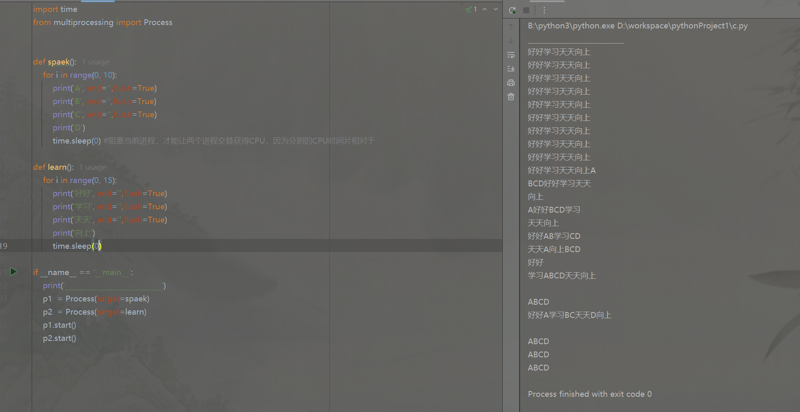

给使用共享资源的不同代码加上相同锁之后，加锁的代码要竞争到锁才能执行共享资源操作，而锁只有一个，因此只有一个进程可以在同一时刻执行

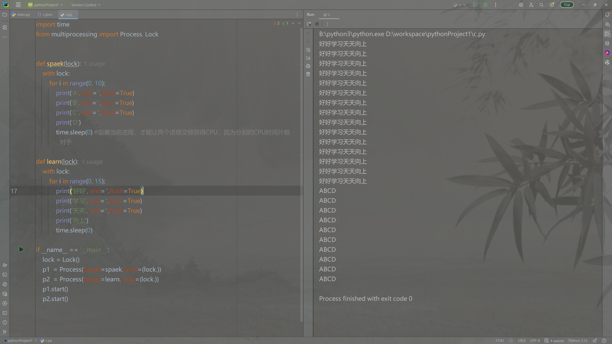

**可重入锁**`RLock`

Lock不支持重入多次加锁，如果有`链式调用`或`递归调用`就可能会因为需要重新获得锁从而出现一直阻塞的情形，可重入锁可以很好地解决这个问题。

RLock在内部维护了`线程标识Thread ID`和`递归层级`每次acquire()时层级都会+1，release()时层级-1，其他线程尝试获取Rlock时会一直阻塞，使用时注意获取锁和释放锁操作的配对，嵌套层级结构尽可能清晰

**进程共享变量Value、Array**

`multiprocessing.Value` 是 Python 多进程模块提供的一个**共享内存对象**，用于在多个进程之间安全地共享一个简单的值（如整数、浮点数等）。它底层基于操作系统的共享内存机制，效率比通过管道或队列传递数据更高，特别适合需要频繁读写的小型数据。

创建Value对象

```py
from multiprocessing import Value

# 方式一：使用类型码字符串
counter = Value('i', 0)       # 'i' 表示有符号整数，初始值 0

# 方式二：使用 ctypes 类型
from ctypes import c_double
pi = Value(c_double, 3.14159)  # 双精度浮点数
```

使用Value对象

```py
counter.value += 1
print(counter.value)
```

常见的类型码

| 类型码 | C 类型           | Python 类型     |
| :----- | :--------------- | :-------------- |
| `'c'`  | `char`           | 字节串（长度1） |
| `'b'`  | `signed char`    | 整数            |
| `'B'`  | `unsigned char`  | 整数            |
| `'h'`  | `signed short`   | 整数            |
| `'H'`  | `unsigned short` | 整数            |
| `'i'`  | `signed int`     | 整数            |
| `'I'`  | `unsigned int`   | 整数            |
| `'l'`  | `signed long`    | 整数            |
| `'L'`  | `unsigned long`  | 整数            |
| `'f'`  | `float`          | 浮点数          |
| `'d'`  | `double`         | 浮点数          |

Value对象默认自带一个绑定的Rlock，用于保证对对象的vlue的读写是原子的，所有的针对c type的原子操作都能做到同步，但是像i += 1操作本身就不是原子操作，因此也不能光靠绑定的锁来实现共享对象的同步

Value对象绑定的这个锁可以显示的修改

```py
counter_no_lock = Value('i', 0, lock=lock)   
```

验证多进程共享Value对象时的同步问题

```py
import time
from multiprocessing import Process, Lock, Value

def add_without_lock(counter:Value, loop_times:int):
    for i in range(0, loop_times):
        counter.value += 1
def add_with_lock(counter:Value, loop_times:int, lock:Lock):
    for i in range(0, loop_times):
        with lock:
            counter.value += 1

if __name__ == '__main__':

    count_processes = 5 # 进程数
    increase_times = 10000 # 每个进程让counter加1的次数
    counter = Value('i', 0) # counter是0的Value对象

    # 不加锁测试用Value对象共享变量执行非原子操作是否会出现同步问题
    # 准备进程
    processes = [Process(target=add_without_lock, args=(counter, increase_times)) for i in range(0, count_processes)]
    # 执行进程
    for p in processes:
        p.start()
    for p in processes:
        p.join()
    print('————未给increase操作上锁————')
    print(f'期望的counter最终数值{0+count_processes*increase_times}')
    print(f'实际的counter最终数值{counter.value}')
    # ————未给increase操作上锁————
    # 期望的counter最终数值50000
    # 实际的counter最终数值18979

    counter = Value('i', 0) # 重新给counter值设置为0
    lock = Lock() # 创建锁

    # 加锁测试用Value对象共享变量是否会出现同步问题
    # 准备进程
    processes = [Process(target=add_with_lock, args=(counter, increase_times, lock)) for i in range(0, count_processes)]
    # 执行进程
    for p in processes:
        p.start()
    for p in processes:
        p.join()
    print('————给increase操作上锁————')
    print(f'期望的counter最终数值{0 + count_processes * increase_times}')
    print(f'实际的counter最终数值{counter.value}')
```

如果进程通信交换的是集合内容比较大，可以考虑使用multiprocessing.Array，具体使用和Value对象类似

```py
from multiprocessing import Array
arr = Array(typecode_or_type, size_or_initializer, lock=True)
```

`size_or_initializer`：指定数组长度，或提供一个可迭代对象（如列表）来初始化数组。

共享Array容器的读写和list容器类似

```py
arr = Array('i', [10, 20, 30, 40])

print(arr[::]) # [10, 20, 30, 40]

# 读取单个元素
print(arr[0])        # 10

# 修改元素
arr[1] = 99
print(arr[1])        # 99

# 切片返回一个新的列表（不是共享数组）
sliced = arr[1:3]
print(sliced)        # [99, 30]

# 获取长度
print(len(arr))      # 4

# 遍历
for value in arr:
    print(value)
```

**GIL**是全局解释器锁（互斥锁），GIL的存在导致同一进程的不同线程必须竞争这把锁来使用CPU执行字节码，所以python多线程和操作系统的多线程不是一一对应的，无法做到并行。

GIL存在的意义是为了保证**内存管理的线程安全**和**C扩展模块的便利性**

- 引用计数问题

  CPython 使用**引用计数**来管理内存。每个 Python 对象都有一个引用计数，记录有多少地方引用了它。当引用计数降为 0 时，对象的内存会被回收。

  引用计数管理如果没有GIL的话会有`内存泄漏`或`程序崩溃`的风险

  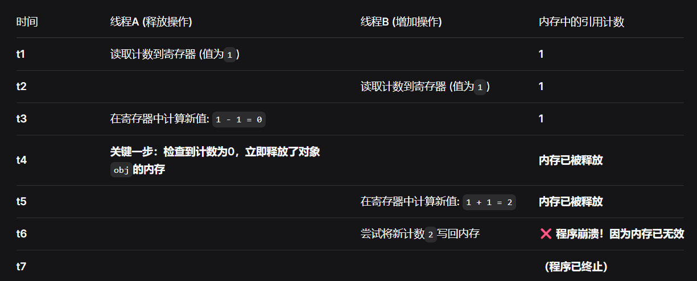

  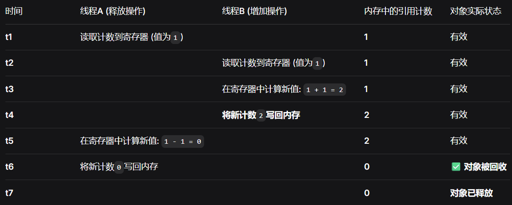

- 方便扩展C扩展模块

  许多py的底层库如numpy、pandas是c代码，这些扩展代码通常是假定在GIL保护下运行可以安全地访问py对象，而不必考虑多线程同步。如果**没有GIL编写这些扩展代码将需要处理大量线程安全细节**

### 实用包

pprint

[一文弄懂Python中的pprint模块 - 知乎](https://zhuanlan.zhihu.com/p/508317313#:~:text=pprint的英文全称Data pretty printer，顾名思义就是让显示结果更加直观漂亮。)

